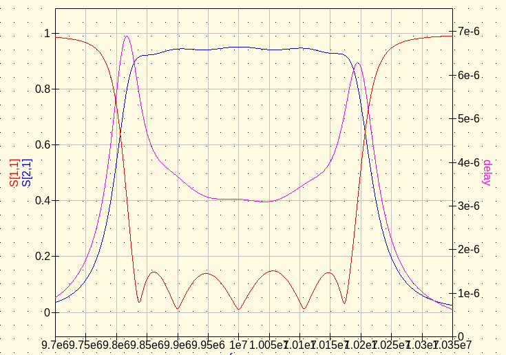

rffilter
----------

Python 3 script for calculating RF filters.
The script requires the numpy library.

For nodal and mesh filters (including crystal filters) the script
will output resonator group delays from Ness as well as 
resonator coupling bandwidths from Dishal.

Library functions
-----------------

The script provides the following public functions for import.

```
# find filter coefficients or prototype values

g    = lowpass_g(name, n):
q, k = coupling_qk(name, n):
q, k = zverev_k(name, n, qo=np.inf):
qo   = zverev_qo(name, n, qo=np.inf):

# coupling coefficent conversion

q, k = to_coupling_qk(g):
cbw  = to_coupling_bw(q, k, BW):
td   = to_group_delay(q, k, BW):

# wide-band filter design

xs, xp, re = to_lowpass(g, fo, R):
xs, xp, re = to_highpass(g, fo, R):
xs, xp, re = to_bandpass(g, fo, BW, R):
xs, xp, re = to_bandstop(g, fo, BW, R):

# narrow-band filter design

xs, xp, re     = to_nodal(q, k, fo, BW, R=None, L=None):
xs, xp, re     = to_mesh(q, k, fo, BW, R=None, L=None):
xs, xp, re, fo = to_crystal_mesh(q, k, fo, BW, LM, CP=0, QU=np.inf):
```

Command Line
-------------

The program takes the following command line options:

```
-g             : lowpass prototype element values
-k             : ideal q, k coupling coefficients
-zverev        : q, k coupling coefficients from Zverev's QO tables
-n             : number of filter poles or resonators
-r             : end resistors, can be given in common notation
-l             : resonator inductor values, can be given in common notation
-f             : design frequency
-bw            : design bandwidth
-qu            : unload Q of resonators
-cp            : parallel capacitance, C0, of crystals
-lowpass       : generate a lowpass filter
-highpass      : generate a highpass filter
-bandpass      : generate a wideband bandpass filter
-bandstop      : generate a wideband bandstop filter
-nodal         : generate a narrow-band nodal bandpass filter
-mesh          : generate a narrow-band mesh bandpass filter
-crystal       : generate a narrow-band crystal bandpass filter
```

Examples
--------

## List of filters types provided


```
$ rffilter.py -g
G LOWPASS         POLES
bessel            2  3  4  5  6  7  8  9 10
butterworth       1  2  3  4  5  6  7  8  9 10 11
chebyshev_0.01    3  4  5  6  7  8  9 10 11
chebyshev_0.044   3  4  5  6  7  8  9 10 11
chebyshev_0.1     2  3  4  5  6  7  8  9
chebyshev_0.2     3  4  5  6  7  8  9 10 11
gaussian_12       3  4  5  6  7  8  9 10
gaussian_6        3  4  5  6  7  8  9 10
linear_phase_05   2  3  4  5  6  7  8  9 10
linear_phase_5    2  3  4  5  6  7  8  9 10
```


```
$ rffilter.py -k
QK COUPLING       POLES
bessel            2  3  4  5  6  7  8
butterworth       2  3  4  5  6  7  8
chebyshev_0.01    2  3  4  5  6  7  8
chebyshev_0.1     2  3  4  5  6  7  8
chebyshev_0.5     2  3  4  5  6  7  8
chebyshev_1.0     2  3  4  5  6  7
gaussian_12       3  4  5  6  7  8
gaussian_6        3  4  5  6  7  8
linear_phase_05   2  3  4  5  6  7  8
linear_phase_5    2  3  4  5  6  7  8
```


```
$ rffilter.py -zverev
QK ZVEREV         POLES
bessel            2  3  4  5  6  7  8
butterworth       2  3  4  5  6  7  8
chebyshev_0.01    2  3  4  5  6  7  8
chebyshev_0.1     2  3  4  5  6  7  8
chebyshev_0.5     2  3  4  5  6  7  8
gaussian          2  3  4  5  6  7  8
gaussian_12       3  4  5  6  7  8
gaussian_6        3  4  5  6  7  8
legendre          3  4  5  6  7  8
linear_phase_05   2  3  4  5  6  7  8
linear_phase_5    2  3  4  5  6  7  8
```


## Coupling bandwidth and group delay

Print out coupling design information.  CBW is the coupling bandwidth between resonators and the bandwidth of the two resonators at the end.
TD0 and TDn are the group delay
at the center freqency for each resonator looking from either end, see 
Ness' "A Unified Approach to the
Design, Measurement, and Tuning of Coupled-Resonator Filters" in MTT.


```
$ rffilter.py -g chebyshev_0.2 -n 8 -bw 1000
* ij    qi,kij           TD0           TDn           CBW
* 01    1.3800  878.5353e-06             -  724.6377e+00
* 12    0.7225  883.6282e-06    3.3733e-03  722.5464e+00
* 23    0.5602    2.3402e-03    5.1911e-03  560.1693e+00
* 34    0.5349    1.8526e-03    2.8023e-03  534.9420e+00
* 45    0.5298    3.8305e-03    3.8317e-03  529.7756e+00
* 56    0.5349    2.8030e-03    1.8522e-03  534.8960e+00
* 67    0.5601    5.1897e-03    2.3410e-03  560.1072e+00
* 78    0.7225    3.3742e-03  883.4691e-06  722.5309e+00
* 89    1.3803             -  878.7312e-06  724.4761e+00

```


## Nodal narrow-band filters.


```
$ rffilter.py -g butterworth -nodal -f 10e6 -bw 400e3 -n 5 | tee examples/nodal.cir
.SUBCKT F1 1 2 3 4 5
* COMMAND  : rffilter.py -g butterworth -nodal -f 10e6 -bw 400e3 -n 5
* TYPE     : BUTTERWORTH
* FILTER   : NODAL
* ORDER    : 5
* FREQ     : 10.000000 MHz
* RS       : 50.0
* RL       : 50.0
* BW       : 400.0000e+03
* QL       : 25.0

* ij    qi,kij           TD0           TDn           CBW
* 01    0.6180  983.6253e-09             -  647.2178e+03
* 12    1.0000    2.5752e-06    5.1503e-06  400.0018e+03
* 23    0.5559    4.1667e-06    5.1503e-06  222.3575e+03
* 34    0.5559    5.1503e-06    4.1667e-06  222.3575e+03
* 45    1.0000    5.1503e-06    2.5752e-06  400.0018e+03
* 56    0.6180             -  983.6253e-09  647.2178e+03

L1  1    0      51.5040e-09
C2  1    0       4.7214e-09
C3  1    2     196.7259e-12

L4  2    0      51.5040e-09
C5  2    0       4.6120e-09
C6  2    3     109.3582e-12

L7  3    0      51.5040e-09
C8  3    0       4.6994e-09
C9  3    4     109.3582e-12

L10 4    0      51.5040e-09
C11 4    0       4.6120e-09
C12 4    5     196.7259e-12

L13 5    0      51.5040e-09
C14 5    0       4.7214e-09
.ends
.end

```



## Narrow-band mesh filters.


```
$ rffilter.py -g butterworth -mesh -f 10e6 -bw 400e3 -n 8 | tee examples/mesh.cir
.SUBCKT F1 1 17
* COMMAND  : rffilter.py -g butterworth -mesh -f 10e6 -bw 400e3 -n 8
* TYPE     : BUTTERWORTH
* FILTER   : MESH
* ORDER    : 8
* FREQ     : 10.000000 MHz
* RS       : 50.0
* RL       : 50.0
* BW       : 400.0000e+03
* QL       : 25.0

* ij    qi,kij           TD0           TDn           CBW
* 01    0.3902  620.9908e-09             -    1.0252e+06
* 12    1.5187    1.7684e-06    8.1580e-06  607.4955e+03
* 23    0.7357    3.2676e-06    8.1580e-06  294.2641e+03
* 34    0.5537    4.8904e-06    7.5370e-06  221.4725e+03
* 45    0.5098    6.3896e-06    6.3896e-06  203.9183e+03
* 56    0.5537    7.5370e-06    4.8904e-06  221.4725e+03
* 67    0.7357    8.1580e-06    3.2676e-06  294.2641e+03
* 78    1.5187    8.1580e-06    1.7684e-06  607.4955e+03
* 89    0.3902             -  620.9908e-09    1.0252e+06

L1  1    2       7.7624e-06
C2  2    3      34.7427e-12

C3  3    0     537.1580e-12
L4  3    4       7.7624e-06
C5  4    5      35.8664e-12

C6  5    0       1.1089e-09
L7  5    6       7.7624e-06
C8  6    7      34.4066e-12

C9  7    0       1.4734e-09
L10 7    8       7.7624e-06
C11 8    9      34.0819e-12

C12 9    0       1.6003e-09
L13 9    10      7.7624e-06
C14 10   11     34.0819e-12

C15 11   0       1.4734e-09
L16 11   12      7.7624e-06
C17 12   13     34.4066e-12

C18 13   0       1.1089e-09
L19 13   14      7.7624e-06
C20 14   15     35.8664e-12

C21 15   0     537.1580e-12
L22 15   16      7.7624e-06
C23 16   17     34.7427e-12
.ends
.end

```


## Crystal mesh filters.

Build a 500 Hz bandwidth crystal filter.


```
$ rffilter.py -g chebyshev_0.01 -n 8 -crystal -l .170 -f 4e6 -bw 500 -cp 2.05e-12
.SUBCKT F1 1 25
* COMMAND  : rffilter.py -g chebyshev_0.01 -n 8 -crystal -l .170 -f 4e6 -bw 500 -cp 2.05e-12
* TYPE     : CHEBYSHEV_0.01
* FILTER   : CRYSTAL_MESH
* ORDER    : 8
* FREQ     : 4.000410 MHz
* RS       : 725.6
* RL       : 725.6
* BW       : 500.0000e+00
* QL       : 8000.8

* ij    qi,kij           TD0           TDn           CBW
* 01    0.8073    1.0279e-03             -  619.3484e+00
* 12    0.9363    1.7991e-03    6.9373e-03  468.1461e+00
* 23    0.6302    3.2968e-03    7.6358e-03  315.0976e+00
* 34    0.5774    3.9419e-03    6.0035e-03  288.7182e+00
* 45    0.5663    5.6561e-03    5.6555e-03  283.1328e+00
* 56    0.5773    6.0033e-03    3.9422e-03  288.6748e+00
* 67    0.6302    7.6360e-03    3.2968e-03  315.1239e+00
* 78    0.9364    6.9371e-03    1.7987e-03  468.2032e+00
* 89    0.8073             -    1.0278e-03  619.3755e+00

C1  1    2       9.3126e-15
L2  2    3     170.0000e-03
C3  1    3       2.0500e-12
C4  3    4     107.6662e-12

C5  4    0      72.5440e-12
C6  4    5       9.3126e-15
L7  5    6     170.0000e-03
C8  4    6       2.0500e-12
C9  6    7     102.0685e-09

C10 7    0     107.7799e-12
C11 7    8       9.3126e-15
L12 8    9     170.0000e-03
C13 7    9       2.0500e-12
C14 9    10    188.9244e-12

C15 10   0     117.6275e-12
C16 10   11      9.3126e-15
L17 11   12    170.0000e-03
C18 10   12      2.0500e-12
C19 12   13    160.4020e-12

C20 13   0     119.9479e-12
C21 13   14      9.3126e-15
L22 14   15    170.0000e-03
C23 13   15      2.0500e-12
C24 15   16    160.3692e-12

C25 16   0     117.6452e-12
C26 16   17      9.3126e-15
L27 17   18    170.0000e-03
C28 16   18      2.0500e-12
C29 18   19    188.9066e-12

C30 19   0     107.7709e-12
C31 19   20      9.3126e-15
L32 20   21    170.0000e-03
C33 19   21      2.0500e-12
C34 21   22    136.1993e-09

C35 22   0      72.5352e-12
C36 22   23      9.3126e-15
L37 23   24    170.0000e-03
C38 22   24      2.0500e-12
C39 24   25    107.6857e-12
.ends
.end

```


Build a 2400 Hz bandwidth crystal filter.  This filter is from an example in Steder's 
"Crystal Ladder Filters for All" paper in QEX.  


```
$ rffilter.py -g chebyshev_0.2 -n 8 -crystal -l 69.7e-3 -f 4913.57e3 -bw 2400 -cp 3.66e-12 | tee examples/xtal.cir
.SUBCKT F1 1 25
* COMMAND  : rffilter.py -g chebyshev_0.2 -n 8 -crystal -l 69.7e-3 -f 4913.57e3 -bw 2400 -cp 3.66e-12
* TYPE     : CHEBYSHEV_0.2
* FILTER   : CRYSTAL_MESH
* ORDER    : 8
* FREQ     : 4.915464 MHz
* RS       : 1153.4
* RL       : 1153.2
* BW       : 2.4000e+03
* QL       : 2048.1

* ij    qi,kij           TD0           TDn           CBW
* 01    1.3800  366.0564e-06             -    1.7391e+03
* 12    0.7225  368.1784e-06    1.4056e-03    1.7341e+03
* 23    0.5602  975.0893e-06    2.1630e-03    1.3444e+03
* 34    0.5349  771.9015e-06    1.1676e-03    1.2839e+03
* 45    0.5298    1.5961e-03    1.5965e-03    1.2715e+03
* 56    0.5349    1.1679e-03  771.7423e-06    1.2838e+03
* 67    0.5601    2.1624e-03  975.4158e-06    1.3443e+03
* 78    0.7225    1.4059e-03  368.1121e-06    1.7341e+03
* 89    1.3803             -  366.1380e-06    1.7387e+03

C1  1    2      15.0527e-15
L2  2    3      69.7000e-03
C3  1    3       3.6600e-12
C4  3    4      36.3085e-12

C5  4    0      28.1524e-12
C6  4    5      15.0527e-15
L7  5    6      69.7000e-03
C8  4    6       3.6600e-12
C9  6    7     298.8735e-09

C10 7    0      36.3129e-12
C11 7    8      15.0527e-15
L12 8    9      69.7000e-03
C13 7    9       3.6600e-12
C14 9    10    108.3878e-12

C15 10   0      38.0254e-12
C16 10   11     15.0527e-15
L17 11   12     69.7000e-03
C18 10   12      3.6600e-12
C19 12   13     93.2808e-12

C20 13   0      38.3962e-12
C21 13   14     15.0527e-15
L22 14   15     69.7000e-03
C23 13   15      3.6600e-12
C24 15   16     93.2612e-12

C25 16   0      38.0287e-12
C26 16   17     15.0527e-15
L27 17   18     69.7000e-03
C28 16   18      3.6600e-12
C29 18   19    108.3253e-12

C30 19   0      36.3170e-12
C31 19   20     15.0527e-15
L32 20   21     69.7000e-03
C33 19   21      3.6600e-12
C34 21   22    139.6574e-09

C35 22   0      28.1530e-12
C36 22   23     15.0527e-15
L37 23   24     69.7000e-03
C38 22   24      3.6600e-12
C39 24   25     36.3075e-12
.ends
.end

```


Same filter with an unloaded Q of 150000.


```
$ rffilter.py -g chebyshev_0.2 -n 8 -crystal -l 69.7e-3 -f 4913.57e3 -bw 2400 -cp 3.66e-12 -qu 150000 | tee examples/xtalloss.cir
.SUBCKT F1 1 33
* COMMAND  : rffilter.py -g chebyshev_0.2 -n 8 -crystal -l 69.7e-3 -f 4913.57e3 -bw 2400 -cp 3.66e-12 -qu 150000
* TYPE     : CHEBYSHEV_0.2
* FILTER   : CRYSTAL_MESH
* ORDER    : 8
* FREQ     : 4.915464 MHz
* RS       : 1153.4
* RL       : 1153.2
* BW       : 2.4000e+03
* QL       : 2048.1
* QU       : 150000.0

* ij    qi,kij           TD0           TDn           CBW
* 01    1.3800  366.0564e-06             -    1.7391e+03
* 12    0.7225  368.1784e-06    1.4056e-03    1.7341e+03
* 23    0.5602  975.0893e-06    2.1630e-03    1.3444e+03
* 34    0.5349  771.9015e-06    1.1676e-03    1.2839e+03
* 45    0.5298    1.5961e-03    1.5965e-03    1.2715e+03
* 56    0.5349    1.1679e-03  771.7423e-06    1.2838e+03
* 67    0.5601    2.1624e-03  975.4158e-06    1.3443e+03
* 78    0.7225    1.4059e-03  368.1121e-06    1.7341e+03
* 89    1.3803             -  366.1380e-06    1.7387e+03

C1  1    2      15.0527e-15
L2  2    3      69.7000e-03
R3  3    4      14.3511e+00
C4  1    4       3.6600e-12
C5  4    5      36.3097e-12

C6  5    0      28.1527e-12
C7  5    6      15.0527e-15
L8  6    7      69.7000e-03
R9  7    8      14.3511e+00
C10 5    8       3.6600e-12
C11 8    9     362.1959e-09

C12 9    0      36.3134e-12
C13 9    10     15.0527e-15
L14 10   11     69.7000e-03
R15 11   12     14.3511e+00
C16 9    12      3.6600e-12
C17 12   13    108.3959e-12

C18 13   0      38.0259e-12
C19 13   14     15.0527e-15
L20 14   15     69.7000e-03
R21 15   16     14.3511e+00
C22 13   16      3.6600e-12
C23 16   17     93.2870e-12

C24 17   0      38.3967e-12
C25 17   18     15.0527e-15
L26 18   19     69.7000e-03
R27 19   20     14.3511e+00
C28 17   20      3.6600e-12
C29 20   21     93.2674e-12

C30 21   0      38.0291e-12
C31 21   22     15.0527e-15
L32 22   23     69.7000e-03
R33 23   24     14.3511e+00
C34 21   24      3.6600e-12
C35 24   25    108.3335e-12

C36 25   0      36.3174e-12
C37 25   26     15.0527e-15
L38 26   27     69.7000e-03
R39 27   28     14.3511e+00
C40 25   28      3.6600e-12
C41 28   29    152.0826e-09

C42 29   0      28.1533e-12
C43 29   30     15.0527e-15
L44 30   31     69.7000e-03
R45 31   32     14.3511e+00
C46 29   32      3.6600e-12
C47 32   33     36.3087e-12
.ends
.end

```


A crystal filter with multiple crystals of different frequencies.  No parallel capacitance was used.


```
$ rffilter.py -k chebyshev_0.5 -bw 2500 -n 8 -l 70e-3 -crystal -f 5000.680e3,5000.123e3,4999.670e3,5000.235e3,5000.320e3,4999.895e3,5000.010e3,5000.485e3 | tee examples/multiple.cir
.SUBCKT F1 1 25
* COMMAND  : rffilter.py -k chebyshev_0.5 -bw 2500 -n 8 -l 70e-3 -crystal -f 5000.680e3,5000.123e3,4999.670e3,5000.235e3,5000.320e3,4999.895e3,5000.010e3,5000.485e3
* TYPE     : CHEBYSHEV_0.5
* FILTER   : CRYSTAL_MESH
* ORDER    : 8
* FREQ     : 5.001612 MHz
* RS       : 615.9
* RL       : 615.9
* BW       : 2.5000e+03
* QL       : 2000.6

* ij    qi,kij           TD0           TDn           CBW
* 01    1.7850  454.5465e-06             -    1.4006e+03
* 12    0.6580  329.4960e-06    1.2890e-03    1.6450e+03
* 23    0.5330    1.1473e-03    2.4582e-03    1.3325e+03
* 34    0.5150  682.4272e-06    1.0554e-03    1.2875e+03
* 45    0.5110    1.8509e-03    1.8172e-03    1.2775e+03
* 56    0.5150    1.0299e-03  699.3288e-06    1.2875e+03
* 67    0.5330    2.5078e-03    1.1306e-03    1.3325e+03
* 78    0.6500    1.2635e-03  337.6566e-06    1.6250e+03
* 89    1.7850             -  454.5465e-06    1.4006e+03

C1  1    2      14.4705e-15
L2  2    3      70.0000e-03
C3  3    4     331.3895e-12

C4  4    0      43.9918e-12
C5  4    5      14.4737e-15
L6  5    6      70.0000e-03
C7  6    7       9.8522e-06

C8  7    0      54.3143e-12
C9  7    8      14.4764e-15
L10 8    9      70.0000e-03
C11 9    10     57.2732e-12

C12 10   0      56.2120e-12
C13 10   11     14.4731e-15
L14 11   12     70.0000e-03
C15 12   13    383.8458e-12

C16 13   0      56.6483e-12
C17 13   14     14.4726e-15
L18 14   15     70.0000e-03
C19 15   16      3.9129e-09

C20 16   0      56.2103e-12
C21 16   17     14.4751e-15
L22 17   18     70.0000e-03
C23 18   19     88.9534e-12

C24 19   0      54.3137e-12
C25 19   20     14.4744e-15
L26 20   21     70.0000e-03
C27 21   22    294.1399e-12

C28 22   0      44.5346e-12
C29 22   23     14.4716e-15
L30 23   24     70.0000e-03
C31 24   25    115.1531e-12
.ends
.end

```


The same crystal filter as above but with holder parallel capacitance across the crystals.  


```
$ rffilter.py -k chebyshev_0.5 -bw 2500 -n 8 -l 70e-3 -crystal -cp 3.7e-12 -f 5000.680e3,5000.123e3,4999.670e3,5000.235e3,5000.320e3,4999.895e3,5000.010e3,5000.485e3 | tee examples/broken.cir
.SUBCKT F1 1 25
* COMMAND  : rffilter.py -k chebyshev_0.5 -bw 2500 -n 8 -l 70e-3 -crystal -cp 3.7e-12 -f 5000.680e3,5000.123e3,4999.670e3,5000.235e3,5000.320e3,4999.895e3,5000.010e3,5000.485e3
* TYPE     : CHEBYSHEV_0.5
* FILTER   : CRYSTAL_MESH
* ORDER    : 8
* FREQ     : 5.001933 MHz
* RS       : 810.3
* RL       : 848.6
* BW       : 2.5000e+03
* QL       : 2000.8

* ij    qi,kij           TD0           TDn           CBW
* 01    1.7850  454.5465e-06             -    1.4006e+03
* 12    0.6580  329.4960e-06    1.2890e-03    1.6450e+03
* 23    0.5330    1.1473e-03    2.4582e-03    1.3325e+03
* 34    0.5150  682.4272e-06    1.0554e-03    1.2875e+03
* 45    0.5110    1.8509e-03    1.8172e-03    1.2775e+03
* 56    0.5150    1.0299e-03  699.3288e-06    1.2875e+03
* 67    0.5330    2.5078e-03    1.1306e-03    1.3325e+03
* 78    0.6500    1.2635e-03  337.6566e-06    1.6250e+03
* 89    1.7850             -  454.5465e-06    1.4006e+03

C1  1    2      14.4705e-15
L2  2    3      70.0000e-03
C3  1    3       3.7000e-12
C4  3    4     129.2824e-12

C5  4    0      31.2510e-12
C6  4    5      14.4737e-15
L7  5    6      70.0000e-03
C8  4    6       3.7000e-12
C9  6    7     461.1271e-09

C10 7    0      34.0121e-12
C11 7    8      14.4764e-15
L12 8    9      70.0000e-03
C13 7    9       3.7000e-12
C14 9    10     41.7101e-12

C15 10   0      35.6953e-12
C16 10   11     14.4731e-15
L17 11   12     70.0000e-03
C18 10   12      3.7000e-12
C19 12   13    312.0102e-12

C20 13   0      39.0842e-12
C21 13   14     14.4726e-15
L22 14   15     70.0000e-03
C23 13   15      3.7000e-12
C24 15   16      1.1144e-09

C25 16   0      37.1498e-12
C26 16   17     14.4751e-15
L27 17   18     70.0000e-03
C28 16   18      3.7000e-12
C29 18   19     65.3799e-12

C30 19   0      34.5333e-12
C31 19   20     14.4744e-15
L32 20   21     70.0000e-03
C33 19   21      3.7000e-12
C34 21   22    227.2237e-12

C35 22   0      30.4743e-12
C36 22   23     14.4716e-15
L37 23   24     70.0000e-03
C38 22   24      3.7000e-12
C39 24   25     70.5414e-12
.ends
.end

```


## Lowpass and highpass filters.


```
$ rffilter.py -g butterworth -lowpass -f 10e6 -n 5 | tee examples/lowpass.cir
.SUBCKT F1 1 4
* COMMAND  : rffilter.py -g butterworth -lowpass -f 10e6 -n 5
* TYPE     : BUTTERWORTH
* FILTER   : LOWPASS
* ORDER    : 5
* FREQ     : 10.000000 MHz
* RS       : 50.0
* RL       : 50.0
L1  1    2     491.8126e-09

C2  2    0     515.0349e-12
L3  2    3       1.5915e-06

C4  3    0     515.0349e-12
L5  3    4     491.8126e-09
.ends
.end

.SUBCKT F1 1 3
* COMMAND  : rffilter.py -g butterworth -lowpass -f 10e6 -n 5
* TYPE     : BUTTERWORTH
* FILTER   : LOWPASS
* ORDER    : 5
* FREQ     : 10.000000 MHz
* RS       : 50.0
* RL       : 50.0
C1  1    0     196.7251e-12
L2  1    2       1.2876e-06

C3  2    0     636.6198e-12
L4  2    3       1.2876e-06

C5  3    0     196.7251e-12
.ends
.end

```


## Wide band bandpass filters.


```
$ rffilter.py -g butterworth -bandpass -f 10e6 -bw 1e6 -n 4
.SUBCKT F1 1 5
* COMMAND  : rffilter.py -g butterworth -bandpass -f 10e6 -bw 1e6 -n 4
* TYPE     : BUTTERWORTH
* FILTER   : BANDPASS
* ORDER    : 4
* FREQ     : 10.000000 MHz
* RS       : 50.0
* RL       : 50.0
* BW       : 1.0000e+06
* QL       : 10.0
L1  1    2       6.0906e-06
C2  2    3      41.5890e-12

L3  3    0      43.0670e-09
C4  3    0       5.8816e-09
L5  3    4      14.7040e-06
C6  4    5      17.2268e-12

L7  5    0     103.9726e-09
C8  5    0       2.4362e-09
.ends
.end

.SUBCKT F1 1 5
* COMMAND  : rffilter.py -g butterworth -bandpass -f 10e6 -bw 1e6 -n 4
* TYPE     : BUTTERWORTH
* FILTER   : BANDPASS
* ORDER    : 4
* FREQ     : 10.000000 MHz
* RS       : 50.0
* RL       : 50.0
* BW       : 1.0000e+06
* QL       : 10.0
L1  1    0     103.9726e-09
C2  1    0       2.4362e-09
L3  1    2      14.7040e-06
C4  2    3      17.2268e-12

L5  3    0      43.0670e-09
C6  3    0       5.8816e-09
L7  3    4       6.0906e-06
C8  4    5      41.5890e-12
.ends
.end

```


## Use of Zverev filter tables with an unloaded Q.


```
$ rffilter.py -zverev butterworth -nodal -qu 2500 -bw 1e6 -f 10e6 -n 3
.SUBCKT F1 1 2 3
* COMMAND  : rffilter.py -zverev butterworth -nodal -qu 2500 -bw 1e6 -f 10e6 -n 3
* TYPE     : BUTTERWORTH
* FILTER   : NODAL
* ORDER    : 3
* FREQ     : 10.000000 MHz
* RS       : 50.0
* RL       : 50.0
* BW       : 1.0000e+06
* QL       : 10.0
* QU       : 2500.0
* QO       : 250.0
* qo       : 20.0

* ij    qi,kij           TD0           TDn           CBW
* 01    0.8041  511.9060e-09             -    1.2436e+06
* 12    0.7687    1.3399e-06    1.5619e-06  768.7000e+03
* 23    0.6582    1.2101e-06    1.0381e-06  658.2000e+03
* 34    1.4156             -  901.1989e-09  706.4142e+03

L1  1    1001   98.9646e-09
R1  1001 0       2.4873e-03
C2  1    0       2.3628e-09
C3  1    2     196.7511e-12

L4  2    1004   98.9646e-09
R4  1004 0       2.4873e-03
C5  2    0       2.1393e-09
C6  2    3     223.5287e-12

L7  3    1007   56.2147e-09
R7  1007 0       1.4128e-03
C8  3    0       4.2825e-09
.ends
.end

```


```
$ rffilter.py -zverev bessel -nodal -qu 2500 -bw 1e6 -f 10e6 -n 8
.SUBCKT F1 1 2 3 4 5 6 7 8
* COMMAND  : rffilter.py -zverev bessel -nodal -qu 2500 -bw 1e6 -f 10e6 -n 8
* TYPE     : BESSEL
* FILTER   : NODAL
* ORDER    : 8
* FREQ     : 10.000000 MHz
* RS       : 50.0
* RL       : 50.0
* BW       : 1.0000e+06
* QL       : 10.0
* QU       : 2500.0
* QO       : 250.0
* qo       : 11.2

* ij    qi,kij           TD0           TDn           CBW
* 01    0.0975   62.0704e-09             -   10.2564e+06
* 12    5.9216  186.2076e-09    1.8516e-06    5.9216e+06
* 23    2.7188  356.5183e-09    2.1501e-06    2.7188e+06
* 34    1.8573  585.2213e-09    1.7763e-06    1.8573e+06
* 45    1.4616  831.9798e-09    1.9966e-06    1.4616e+06
* 56    1.2253    1.1530e-06    1.4191e-06    1.2253e+06
* 67    1.0138    1.5265e-06    1.6676e-06    1.0138e+06
* 78    0.6333    2.6079e-06  842.4306e-09  633.3000e+03
* 89    1.8842             -    1.1995e-06  530.7292e+03

L1  1    1001  816.1792e-09
R1  1001 0      20.5128e-03
C2  1    0     126.5740e-12
C3  1    2     183.7781e-12

L4  2    1004  816.1792e-09
R4  1004 0      20.5128e-03
C5  2    0      42.1955e-12
C6  2    3      84.3785e-12

L7  3    1007  816.1792e-09
R7  1007 0      20.5128e-03
C8  3    0     168.3319e-12
C9  3    4      57.6417e-12

L10 4    1010  816.1792e-09
R10 1010 0      20.5128e-03
C11 4    0     207.3494e-12
C12 4    5      45.3611e-12

L13 5    1013  816.1792e-09
R13 1013 0      20.5128e-03
C14 5    0     226.9636e-12
C15 5    6      38.0274e-12

L16 6    1016  816.1792e-09
R16 1016 0      20.5128e-03
C17 6    0     240.8612e-12
C18 6    7      31.4635e-12

L19 7    1019  816.1792e-09
R19 1019 0      20.5128e-03
C20 7    0     192.4863e-12
C21 7    8      86.4023e-12

L22 8    1022   42.2341e-09
R22 1022 0       1.0615e-03
C23 8    0       5.9112e-09
.ends
.end

.SUBCKT F1 1 2 3 4 5 6 7 8
* COMMAND  : rffilter.py -zverev bessel -nodal -qu 2500 -bw 1e6 -f 10e6 -n 8
* TYPE     : BESSEL
* FILTER   : NODAL
* ORDER    : 8
* FREQ     : 10.000000 MHz
* RS       : 50.0
* RL       : 50.0
* BW       : 1.0000e+06
* QL       : 10.0
* QU       : 2500.0
* QO       : 250.0
* qo       : 11.2

* ij    qi,kij           TD0           TDn           CBW
* 01    0.1192   75.8851e-09             -    8.3893e+06
* 12    4.8959  222.8121e-09    2.6848e-06    4.8959e+06
* 23    2.3142  415.5257e-09    1.4829e-06    2.3142e+06
* 34    1.6364  668.4290e-09    2.6052e-06    1.6364e+06
* 45    1.3128  943.2432e-09    1.2707e-06    1.3128e+06
* 56    1.1222    1.2783e-06    2.2486e-06    1.1222e+06
* 67    0.6417    2.5571e-06  846.2446e-09  641.7000e+03
* 78    0.9493    1.5569e-06    1.6945e-06  949.3000e+03
* 89    0.4169             -  265.4068e-09    2.3987e+06

L1  1    1001  667.5962e-09
R1  1001 0      16.7785e-03
C2  1    0     193.6625e-12
C3  1    2     185.7629e-12

L4  2    1004  667.5962e-09
R4  1004 0      16.7785e-03
C5  2    0     105.8559e-12
C6  2    3      87.8066e-12

L7  3    1007  667.5962e-09
R7  1007 0      16.7785e-03
C8  3    0     229.5296e-12
C9  3    4      62.0892e-12

L10 4    1010  667.5962e-09
R10 1010 0      16.7785e-03
C11 4    0     267.5252e-12
C12 4    5      49.8110e-12

L13 5    1013  667.5962e-09
R13 1013 0      16.7785e-03
C14 5    0     287.0353e-12
C15 5    6      42.5791e-12

L16 6    1016  667.5962e-09
R16 1016 0      16.7785e-03
C17 6    0     312.4985e-12
C18 6    7      24.3477e-12

L19 7    1019  667.5962e-09
R19 1019 0      16.7785e-03
C20 7    0     287.7168e-12
C21 7    8      67.3609e-12

L22 8    1022  190.8790e-09
R22 1022 0       4.7973e-03
C23 8    0       1.2597e-09
.ends
.end

.SUBCKT F1 1 2 3 4 5 6 7 8
* COMMAND  : rffilter.py -zverev bessel -nodal -qu 2500 -bw 1e6 -f 10e6 -n 8
* TYPE     : BESSEL
* FILTER   : NODAL
* ORDER    : 8
* FREQ     : 10.000000 MHz
* RS       : 50.0
* RL       : 50.0
* BW       : 1.0000e+06
* QL       : 10.0
* QU       : 2500.0
* QO       : 250.0
* qo       : 11.2

* ij    qi,kij           TD0           TDn           CBW
* 01    0.1474   93.8378e-09             -    6.7843e+06
* 12    4.0137  268.0975e-09    1.5752e-06    4.0137e+06
* 23    1.9766  480.7655e-09    2.5273e-06    1.9766e+06
* 34    1.4331  778.1060e-09    1.4780e-06    1.4331e+06
* 45    1.2361    1.0009e-06    2.2687e-06    1.2361e+06
* 56    0.6818    2.4545e-06    1.0769e-06  681.8000e+03
* 67    0.6825    1.5199e-06    1.7766e-06  682.5000e+03
* 78    2.1762    2.6194e-06  537.9182e-09    2.1762e+06
* 89    0.2499             -  159.0913e-09    4.0016e+06

L1  1    1001  539.8743e-09
R1  1001 0      13.5685e-03
C2  1    0     280.8705e-12
C3  1    2     188.3183e-12

L4  2    1004  539.8743e-09
R4  1004 0      13.5685e-03
C5  2    0     188.1306e-12
C6  2    3      92.7399e-12

L7  3    1007  539.8743e-09
R7  1007 0      13.5685e-03
C8  3    0     309.2095e-12
C9  3    4      67.2394e-12

L10 4    1010  539.8743e-09
R10 1010 0      13.5685e-03
C11 4    0     343.9529e-12
C12 4    5      57.9964e-12

L13 5    1013  539.8743e-09
R13 1013 0      13.5685e-03
C14 5    0     379.2031e-12
C15 5    6      31.9893e-12

L16 6    1016  539.8743e-09
R16 1016 0      13.5685e-03
C17 6    0     405.1773e-12
C18 6    7      32.0221e-12

L19 7    1019  539.8743e-09
R19 1019 0      13.5685e-03
C20 7    0     304.2189e-12
C21 7    8     132.9477e-12

L22 8    1022  318.4373e-09
R22 1022 0       8.0032e-03
C23 8    0     662.5087e-12
.ends
.end

.SUBCKT F1 1 2 3 4 5 6 7 8
* COMMAND  : rffilter.py -zverev bessel -nodal -qu 2500 -bw 1e6 -f 10e6 -n 8
* TYPE     : BESSEL
* FILTER   : NODAL
* ORDER    : 8
* FREQ     : 10.000000 MHz
* RS       : 50.0
* RL       : 50.0
* BW       : 1.0000e+06
* QL       : 10.0
* QU       : 2500.0
* QO       : 250.0
* qo       : 11.2

* ij    qi,kij           TD0           TDn           CBW
* 01    0.2034  129.4885e-09             -    4.9164e+06
* 12    3.1367  318.1143e-09    2.6241e-06    3.1367e+06
* 23    1.6246  612.1961e-09    1.5171e-06    1.6246e+06
* 34    1.3923  751.2365e-09    2.4902e-06    1.3923e+06
* 45    0.7691    2.1941e-06    1.2094e-06  769.1000e+03
* 56    0.6027    1.4565e-06    1.9911e-06  602.7000e+03
* 67    1.2931    2.5378e-06  790.5759e-09    1.2931e+06
* 78    3.2425    1.5687e-06  355.3453e-09    3.2425e+06
* 89    0.1704             -  108.4800e-09    5.8685e+06

L1  1    1001  391.2363e-09
R1  1001 0       9.8328e-03
C2  1    0     444.3591e-12
C3  1    2     203.0832e-12

L4  2    1004  391.2363e-09
R4  1004 0       9.8328e-03
C5  2    0     339.1756e-12
C6  2    3     105.1835e-12

L7  3    1007  391.2363e-09
R7  1007 0       9.8328e-03
C8  3    0     452.1154e-12
C9  3    4      90.1434e-12

L10 4    1010  391.2363e-09
R10 1010 0       9.8328e-03
C11 4    0     507.5041e-12
C12 4    5      49.7948e-12

L13 5    1013  391.2363e-09
R13 1013 0       9.8328e-03
C14 5    0     558.6262e-12
C15 5    6      39.0213e-12

L16 6    1016  391.2363e-09
R16 1016 0       9.8328e-03
C17 6    0     524.7002e-12
C18 6    7      83.7208e-12

L19 7    1019  391.2363e-09
R19 1019 0       9.8328e-03
C20 7    0     371.5715e-12
C21 7    8     192.1500e-12

L22 8    1022  467.0039e-09
R22 1022 0      11.7371e-03
C23 8    0     350.2500e-12
.ends
.end

.SUBCKT F1 1 2 3 4 5 6 7 8
* COMMAND  : rffilter.py -zverev bessel -nodal -qu 2500 -bw 1e6 -f 10e6 -n 8
* TYPE     : BESSEL
* FILTER   : NODAL
* ORDER    : 8
* FREQ     : 10.000000 MHz
* RS       : 50.0
* RL       : 50.0
* BW       : 1.0000e+06
* QL       : 10.0
* QU       : 2500.0
* QO       : 250.0
* qo       : 11.2

* ij    qi,kij           TD0           TDn           CBW
* 01    0.1332   84.7978e-09             -    7.5075e+06
* 12    4.3253  255.4721e-09    1.5909e-06    4.3253e+06
* 23    2.0981  445.1809e-09    2.4956e-06    2.0981e+06
* 34    1.4629  780.9646e-09    1.4955e-06    1.4629e+06
* 45    1.1695    1.0091e-06    2.2684e-06    1.1695e+06
* 56    0.6307    2.5878e-06    1.0903e-06  630.7000e+03
* 67    0.7436    1.4147e-06    1.8011e-06  743.6000e+03
* 78    2.1384    2.8063e-06  456.1605e-09    2.1384e+06
* 89    0.3052             -  194.2964e-09    3.2765e+06

L1  1    1001  597.4285e-09
R1  1001 0      15.0150e-03
C2  1    0     240.6009e-12
C3  1    2     183.3879e-12

L4  2    1004  597.4285e-09
R4  1004 0      15.0150e-03
C5  2    0     151.6438e-12
C6  2    3      88.9571e-12

L7  3    1007  597.4285e-09
R7  1007 0      15.0150e-03
C8  3    0     273.0064e-12
C9  3    4      62.0253e-12

L10 4    1010  597.4285e-09
R10 1010 0      15.0150e-03
C11 4    0     312.3780e-12
C12 4    5      49.5855e-12

L13 5    1013  597.4285e-09
R13 1013 0      15.0150e-03
C14 5    0     347.6623e-12
C15 5    6      26.7410e-12

L16 6    1016  597.4285e-09
R16 1016 0      15.0150e-03
C17 6    0     365.7200e-12
C18 6    7      31.5278e-12

L19 7    1019  597.4285e-09
R19 1019 0      15.0150e-03
C20 7    0     255.2201e-12
C21 7    8     137.2409e-12

L22 8    1022  260.7388e-09
R22 1022 0       6.5531e-03
C23 8    0     834.2409e-12
.ends
.end

.SUBCKT F1 1 2 3 4 5 6 7 8
* COMMAND  : rffilter.py -zverev bessel -nodal -qu 2500 -bw 1e6 -f 10e6 -n 8
* TYPE     : BESSEL
* FILTER   : NODAL
* ORDER    : 8
* FREQ     : 10.000000 MHz
* RS       : 50.0
* RL       : 50.0
* BW       : 1.0000e+06
* QL       : 10.0
* QU       : 2500.0
* QO       : 250.0
* qo       : 11.2

* ij    qi,kij           TD0           TDn           CBW
* 01    0.1772  112.8090e-09             -    5.6433e+06
* 12    3.3376  322.5135e-09    2.5625e-06    3.3376e+06
* 23    1.0876    1.1752e-06    1.9523e-06    1.0876e+06
* 34    1.3420  534.3404e-09    2.5140e-06    1.3420e+06
* 45    0.6980    5.1022e-06    1.2016e-06  698.0000e+03
* 56    0.6410  785.5151e-09    2.0576e-06  641.0000e+03
* 67    1.3675    5.9651e-06  708.4631e-09    1.3675e+06
* 78    2.9724  838.6790e-09  370.6546e-09    2.9724e+06
* 89    0.1944             -  123.7589e-09    5.1440e+06

L1  1    1001  449.0828e-09
R1  1001 0      11.2867e-03
C2  1    0     375.7894e-12
C3  1    2     188.2557e-12

L4  2    1004  449.0828e-09
R4  1004 0      11.2867e-03
C5  2    0     314.4439e-12
C6  2    3      61.3455e-12

L7  3    1007  449.0828e-09
R7  1007 0      11.2867e-03
C8  3    0     427.0047e-12
C9  3    4      75.6949e-12

L10 4    1010  449.0828e-09
R10 1010 0      11.2867e-03
C11 4    0     448.9799e-12
C12 4    5      39.3703e-12

L13 5    1013  449.0828e-09
R13 1013 0      11.2867e-03
C14 5    0     488.5195e-12
C15 5    6      36.1553e-12

L16 6    1016  449.0828e-09
R16 1016 0      11.2867e-03
C17 6    0     450.7567e-12
C18 6    7      77.1332e-12

L19 7    1019  449.0828e-09
R19 1019 0      11.2867e-03
C20 7    0     311.3067e-12
C21 7    8     175.6052e-12

L22 8    1022  409.3491e-09
R22 1022 0      10.2881e-03
C23 8    0     443.1892e-12
.ends
.end

.SUBCKT F1 1 2 3 4 5 6 7 8
* COMMAND  : rffilter.py -zverev bessel -nodal -qu 2500 -bw 1e6 -f 10e6 -n 8
* TYPE     : BESSEL
* FILTER   : NODAL
* ORDER    : 8
* FREQ     : 10.000000 MHz
* RS       : 50.0
* RL       : 50.0
* BW       : 1.0000e+06
* QL       : 10.0
* QU       : 2500.0
* QO       : 250.0
* qo       : 11.2

* ij    qi,kij           TD0           TDn           CBW
* 01    0.2476  157.6271e-09             -    4.0388e+06
* 12    2.5022  410.6629e-09    1.5610e-06    2.5022e+06
* 23    1.5729  556.5349e-09    2.5503e-06    1.5729e+06
* 34    0.7831    2.0674e-06    1.3976e-06  783.1000e+03
* 45    0.6019    1.2318e-06    2.1541e-06  601.9000e+03
* 56    1.1206    2.5454e-06  984.1625e-09    1.1206e+06
* 67    1.7580    1.5061e-06  555.5318e-09    1.7580e+06
* 78    3.8868    2.6431e-06  284.3463e-09    3.8868e+06
* 89    0.1482             -   94.3471e-09    6.7476e+06

L1  1    1001  321.3953e-09
R1  1001 0       8.0775e-03
C2  1    0     590.9281e-12
C3  1    2     197.2072e-12

L4  2    1004  321.3953e-09
R4  1004 0       8.0775e-03
C5  2    0     466.9623e-12
C6  2    3     123.9658e-12

L7  3    1007  321.3953e-09
R7  1007 0       8.0775e-03
C8  3    0     602.4506e-12
C9  3    4      61.7189e-12

L10 4    1010  321.3953e-09
R10 1010 0       8.0775e-03
C11 4    0     678.9785e-12
C12 4    5      47.4379e-12

L13 5    1013  321.3953e-09
R13 1013 0       8.0775e-03
C14 5    0     652.3790e-12
C15 5    6      88.3184e-12

L16 6    1016  321.3953e-09
R16 1016 0       8.0775e-03
C17 6    0     561.2627e-12
C18 6    7     138.5542e-12

L19 7    1019  321.3953e-09
R19 1019 0       8.0775e-03
C20 7    0     412.5847e-12
C21 7    8     236.9964e-12

L22 8    1022  536.9600e-09
R22 1022 0      13.4953e-03
C23 8    0     234.7389e-12
.ends
.end

.SUBCKT F1 1 2 3 4 5 6 7 8
* COMMAND  : rffilter.py -zverev bessel -nodal -qu 2500 -bw 1e6 -f 10e6 -n 8
* TYPE     : BESSEL
* FILTER   : NODAL
* ORDER    : 8
* FREQ     : 10.000000 MHz
* RS       : 50.0
* RL       : 50.0
* BW       : 1.0000e+06
* QL       : 10.0
* QU       : 2500.0
* QO       : 250.0
* qo       : 11.2

* ij    qi,kij           TD0           TDn           CBW
* 01    0.4606  293.2271e-09             -    2.1711e+06
* 12    2.1216  307.0642e-09    2.6107e-06    2.1216e+06
* 23    0.9547    1.7413e-06    1.5248e-06  954.7000e+03
* 34    0.5810    1.1362e-06    2.3019e-06  581.0000e+03
* 45    0.9670    2.2641e-06    1.2332e-06  967.0000e+03
* 56    1.4066    1.5280e-06  776.8161e-09    1.4066e+06
* 67    2.1941    2.4789e-06  445.9809e-09    2.1941e+06
* 78    4.9228    1.6059e-06  226.2682e-09    4.9228e+06
* 89    0.1161             -   73.9116e-09    8.6133e+06

L1  1    1001  172.7692e-09
R1  1001 0       4.3422e-03
C2  1    0       1.1551e-09
C3  1    2     311.0553e-12

L4  2    1004  172.7692e-09
R4  1004 0       4.3422e-03
C5  2    0       1.0151e-09
C6  2    3     139.9719e-12

L7  3    1007  172.7692e-09
R7  1007 0       4.3422e-03
C8  3    0       1.2410e-09
C9  3    4      85.1825e-12

L10 4    1010  172.7692e-09
R10 1010 0       4.3422e-03
C11 4    0       1.2392e-09
C12 4    5     141.7753e-12

L13 5    1013  172.7692e-09
R13 1013 0       4.3422e-03
C14 5    0       1.1181e-09
C15 5    6     206.2266e-12

L16 6    1016  172.7692e-09
R16 1016 0       4.3422e-03
C17 6    0     938.2240e-12
C18 6    7     321.6848e-12

L19 7    1019  172.7692e-09
R19 1019 0       4.3422e-03
C20 7    0     782.0905e-12
C21 7    8     362.3601e-12

L22 8    1022  685.4218e-09
R22 1022 0      17.2265e-03
C23 8    0       7.1977e-12
.ends
.end

```


## More examples


```
$ rffilter.py -k butterworth -nodal -f 10e6 -bw 1e6 -n 5
.SUBCKT F1 1 2 3 4 5
* COMMAND  : rffilter.py -k butterworth -nodal -f 10e6 -bw 1e6 -n 5
* TYPE     : BUTTERWORTH
* FILTER   : NODAL
* ORDER    : 5
* FREQ     : 10.000000 MHz
* RS       : 50.0
* RL       : 50.0
* BW       : 1.0000e+06
* QL       : 10.0

* ij    qi,kij           TD0           TDn           CBW
* 01    0.6180  393.4310e-09             -    1.6181e+06
* 12    1.0000    1.0301e-06    2.0595e-06    1.0000e+06
* 23    0.5560    1.6661e-06    2.0603e-06  556.0000e+03
* 34    0.5560    2.0603e-06    1.6661e-06  556.0000e+03
* 45    1.0000    2.0595e-06    1.0301e-06    1.0000e+06
* 56    0.6180             -  393.4310e-09    1.6181e+06

L1  1    0     128.7661e-09
C2  1    0       1.7704e-09
C3  1    2     196.7155e-12

L4  2    0     128.7661e-09
C5  2    0       1.6611e-09
C6  2    3     109.3738e-12

L7  3    0     128.7661e-09
C8  3    0       1.7484e-09
C9  3    4     109.3738e-12

L10 4    0     128.7661e-09
C11 4    0       1.6611e-09
C12 4    5     196.7155e-12

L13 5    0     128.7661e-09
C14 5    0       1.7704e-09
.ends
.end

```


```
$ rffilter.py -g butterworth -nodal -f 10e6 -bw 400e3 -n 5 -l 100e-9,100e-9,100e-9,100e-9,100e-9
.SUBCKT F1 1 2 3 4 5
* COMMAND  : rffilter.py -g butterworth -nodal -f 10e6 -bw 400e3 -n 5 -l 100e-9,100e-9,100e-9,100e-9,100e-9
* TYPE     : BUTTERWORTH
* FILTER   : NODAL
* ORDER    : 5
* FREQ     : 10.000000 MHz
* RS       : 97.1
* RL       : 97.1
* BW       : 400.0000e+03
* QL       : 25.0

* ij    qi,kij           TD0           TDn           CBW
* 01    0.6180  983.6253e-09             -  647.2178e+03
* 12    1.0000    2.5752e-06    5.1503e-06  400.0018e+03
* 23    0.5559    4.1667e-06    5.1503e-06  222.3575e+03
* 34    0.5559    5.1503e-06    4.1667e-06  222.3575e+03
* 45    1.0000    5.1503e-06    2.5752e-06  400.0018e+03
* 56    0.6180             -  983.6253e-09  647.2178e+03

L1  1    0     100.0000e-09
C2  1    0       2.4317e-09
C3  1    2     101.3216e-12

L4  2    0     100.0000e-09
C5  2    0       2.3754e-09
C6  2    3      56.3238e-12

L7  3    0     100.0000e-09
C8  3    0       2.4204e-09
C9  3    4      56.3238e-12

L10 4    0     100.0000e-09
C11 4    0       2.3754e-09
C12 4    5     101.3216e-12

L13 5    0     100.0000e-09
C14 5    0       2.4317e-09
.ends
.end

```


```
$ rffilter.py -g butterworth -nodal -f 10e6 -bw 400e3 -n 5 -r 100,120
.SUBCKT F1 1 2 3 4 5
* COMMAND  : rffilter.py -g butterworth -nodal -f 10e6 -bw 400e3 -n 5 -r 100,120
* TYPE     : BUTTERWORTH
* FILTER   : NODAL
* ORDER    : 5
* FREQ     : 10.000000 MHz
* RS       : 100.0
* RL       : 120.0
* BW       : 400.0000e+03
* QL       : 25.0

* ij    qi,kij           TD0           TDn           CBW
* 01    0.6180  983.6253e-09             -  647.2178e+03
* 12    1.0000    2.5752e-06    5.1503e-06  400.0018e+03
* 23    0.5559    4.1667e-06    5.1503e-06  222.3575e+03
* 34    0.5559    5.1503e-06    4.1667e-06  222.3575e+03
* 45    1.0000    5.1503e-06    2.5752e-06  400.0018e+03
* 56    0.6180             -  983.6253e-09  647.2178e+03

L1  1    0     103.0079e-09
C2  1    0       2.3607e-09
C3  1    2      98.3630e-12

L4  2    0     103.0079e-09
C5  2    0       2.3060e-09
C6  2    3      54.6791e-12

L7  3    0     103.0079e-09
C8  3    0       2.3497e-09
C9  3    4      54.6791e-12

L10 4    0     103.0079e-09
C11 4    0       2.3146e-09
C12 4    5      89.7927e-12

L13 5    0     123.6095e-09
C14 5    0       1.9594e-09
.ends
.end

```


```
$ rffilter.py -g butterworth -lowpass -f 10e6 -n 5 -r 75
.SUBCKT F1 1 4
* COMMAND  : rffilter.py -g butterworth -lowpass -f 10e6 -n 5 -r 75
* TYPE     : BUTTERWORTH
* FILTER   : LOWPASS
* ORDER    : 5
* FREQ     : 10.000000 MHz
* RS       : 75.0
* RL       : 75.0
L1  1    2     737.7190e-09

C2  2    0     343.3566e-12
L3  2    3       2.3873e-06

C4  3    0     343.3566e-12
L5  3    4     737.7190e-09
.ends
.end

.SUBCKT F1 1 3
* COMMAND  : rffilter.py -g butterworth -lowpass -f 10e6 -n 5 -r 75
* TYPE     : BUTTERWORTH
* FILTER   : LOWPASS
* ORDER    : 5
* FREQ     : 10.000000 MHz
* RS       : 75.0
* RL       : 75.0
C1  1    0     131.1500e-12
L2  1    2       1.9314e-06

C3  2    0     424.4132e-12
L4  2    3       1.9314e-06

C5  3    0     131.1500e-12
.ends
.end

```


```
$ rffilter.py -g butterworth -highpass -f 10e6 -n 5 -r 75
.SUBCKT F1 1 4
* COMMAND  : rffilter.py -g butterworth -highpass -f 10e6 -n 5 -r 75
* TYPE     : BUTTERWORTH
* FILTER   : HIGHPASS
* ORDER    : 5
* FREQ     : 10.000000 MHz
* RS       : 75.0
* RL       : 75.0
C1  1    2     343.3597e-12

L2  2    0     737.7256e-09
C3  2    3     106.1033e-12

L4  3    0     737.7256e-09
C5  3    4     343.3597e-12
.ends
.end

.SUBCKT F1 1 3
* COMMAND  : rffilter.py -g butterworth -highpass -f 10e6 -n 5 -r 75
* TYPE     : BUTTERWORTH
* FILTER   : HIGHPASS
* ORDER    : 5
* FREQ     : 10.000000 MHz
* RS       : 75.0
* RL       : 75.0
L1  1    0       1.9314e-06
C2  1    2     131.1512e-12

L3  2    0     596.8310e-09
C4  2    3     131.1512e-12

L5  3    0       1.9314e-06
.ends
.end

```


```
$ rffilter.py -g butterworth -mesh -f 10e6 -bw 400e3 -n 8 -qu 2000
.SUBCKT F1 1 25
* COMMAND  : rffilter.py -g butterworth -mesh -f 10e6 -bw 400e3 -n 8 -qu 2000
* TYPE     : BUTTERWORTH
* FILTER   : MESH
* ORDER    : 8
* FREQ     : 10.000000 MHz
* RS       : 50.0
* RL       : 50.0
* BW       : 400.0000e+03
* QL       : 25.0
* QU       : 2000.0

* ij    qi,kij           TD0           TDn           CBW
* 01    0.3902  620.9908e-09             -    1.0252e+06
* 12    1.5187    1.7684e-06    8.1580e-06  607.4955e+03
* 23    0.7357    3.2676e-06    8.1580e-06  294.2641e+03
* 34    0.5537    4.8904e-06    7.5370e-06  221.4725e+03
* 45    0.5098    6.3896e-06    6.3896e-06  203.9183e+03
* 56    0.5537    7.5370e-06    4.8904e-06  221.4725e+03
* 67    0.7357    8.1580e-06    3.2676e-06  294.2641e+03
* 78    1.5187    8.1580e-06    1.7684e-06  607.4955e+03
* 89    0.3902             -  620.9908e-09    1.0252e+06

L1  1    2       7.7624e-06
R2  2    3     243.8625e-03
C3  3    4      34.7427e-12

C4  4    0     537.1580e-12
L5  4    5       7.7624e-06
R6  5    6     243.8625e-03
C7  6    7      35.8664e-12

C8  7    0       1.1089e-09
L9  7    8       7.7624e-06
R10 8    9     243.8625e-03
C11 9    10     34.4066e-12

C12 10   0       1.4734e-09
L13 10   11      7.7624e-06
R14 11   12    243.8625e-03
C15 12   13     34.0819e-12

C16 13   0       1.6003e-09
L17 13   14      7.7624e-06
R18 14   15    243.8625e-03
C19 15   16     34.0819e-12

C20 16   0       1.4734e-09
L21 16   17      7.7624e-06
R22 17   18    243.8625e-03
C23 18   19     34.4066e-12

C24 19   0       1.1089e-09
L25 19   20      7.7624e-06
R26 20   21    243.8625e-03
C27 21   22     35.8664e-12

C28 22   0     537.1580e-12
L29 22   23      7.7624e-06
R30 23   24    243.8625e-03
C31 24   25     34.7427e-12
.ends
.end

```


```
$ rffilter.py -g butterworth -mesh -f 10e6 -bw 400e3 -n 4 -l 100e-9
.SUBCKT F1 1 9
* COMMAND  : rffilter.py -g butterworth -mesh -f 10e6 -bw 400e3 -n 4 -l 100e-9
* TYPE     : BUTTERWORTH
* FILTER   : MESH
* ORDER    : 4
* FREQ     : 10.000000 MHz
* RS       : 0.3
* RL       : 0.3
* BW       : 400.0000e+03
* QL       : 25.0

* ij    qi,kij           TD0           TDn           CBW
* 01    0.7654    1.2181e-06             -  522.6230e+03
* 12    0.8409    2.9408e-06    4.1589e-06  336.3578e+03
* 23    0.5412    4.1589e-06    4.1589e-06  216.4783e+03
* 34    0.8409    4.1589e-06    2.9408e-06  336.3578e+03
* 45    0.7654             -    1.2181e-06  522.6230e+03

L1  1    2     100.0000e-09
C2  2    3       2.6212e-09

C3  3    0      75.3076e-09
L4  3    4     100.0000e-09
C5  4    5       2.6813e-09

C6  5    0     117.0108e-09
L7  5    6     100.0000e-09
C8  6    7       2.6813e-09

C9  7    0      75.3076e-09
L10 7    8     100.0000e-09
C11 8    9       2.6212e-09
.ends
.end

```


```
$ rffilter.py -g butterworth -mesh -f 10e6 -bw 400e3 -n 4 -r 100
.SUBCKT F1 1 9
* COMMAND  : rffilter.py -g butterworth -mesh -f 10e6 -bw 400e3 -n 4 -r 100
* TYPE     : BUTTERWORTH
* FILTER   : MESH
* ORDER    : 4
* FREQ     : 10.000000 MHz
* RS       : 100.0
* RL       : 100.0
* BW       : 400.0000e+03
* QL       : 25.0

* ij    qi,kij           TD0           TDn           CBW
* 01    0.7654    1.2181e-06             -  522.6230e+03
* 12    0.8409    2.9408e-06    4.1589e-06  336.3578e+03
* 23    0.5412    4.1589e-06    4.1589e-06  216.4783e+03
* 34    0.8409    4.1589e-06    2.9408e-06  336.3578e+03
* 45    0.7654             -    1.2181e-06  522.6230e+03

L1  1    2      30.4531e-06
C2  2    3       8.6073e-12

C3  3    0     247.2904e-12
L4  3    4      30.4531e-06
C5  4    5       8.8046e-12

C6  5    0     384.2326e-12
L7  5    6      30.4531e-06
C8  6    7       8.8046e-12

C9  7    0     247.2904e-12
L10 7    8      30.4531e-06
C11 8    9       8.6073e-12
.ends
.end

```


```
$ rffilter.py -g butterworth -mesh -f 10e6 -bw 400e3 -n 4 -r 100,120
.SUBCKT F1 1 9
* COMMAND  : rffilter.py -g butterworth -mesh -f 10e6 -bw 400e3 -n 4 -r 100,120
* TYPE     : BUTTERWORTH
* FILTER   : MESH
* ORDER    : 4
* FREQ     : 10.000000 MHz
* RS       : 100.0
* RL       : 120.0
* BW       : 400.0000e+03
* QL       : 25.0

* ij    qi,kij           TD0           TDn           CBW
* 01    0.7654    1.2181e-06             -  522.6230e+03
* 12    0.8409    2.9408e-06    4.1589e-06  336.3578e+03
* 23    0.5412    4.1589e-06    4.1589e-06  216.4783e+03
* 34    0.8409    4.1589e-06    2.9408e-06  336.3578e+03
* 45    0.7654             -    1.2181e-06  522.6230e+03

L1  1    2      30.4531e-06
C2  2    3       8.6073e-12

C3  3    0     247.2904e-12
L4  3    4      30.4531e-06
C5  4    5       8.8046e-12

C6  5    0     384.2326e-12
L7  5    6      30.4531e-06
C8  6    7       8.8346e-12

C9  7    0     225.7442e-12
L10 7    8      36.5437e-06
C11 8    9       7.1511e-12
.ends
.end

```


