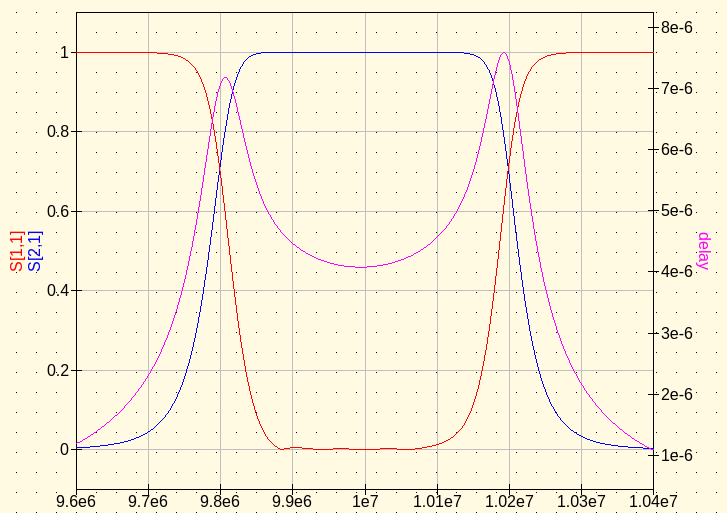
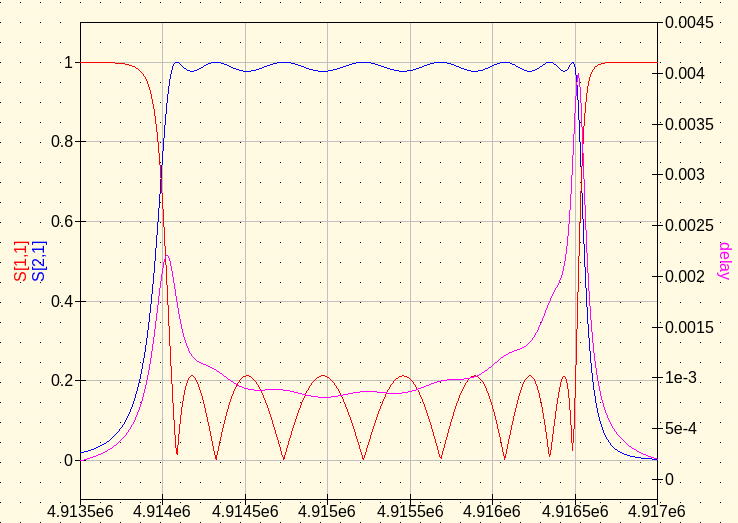
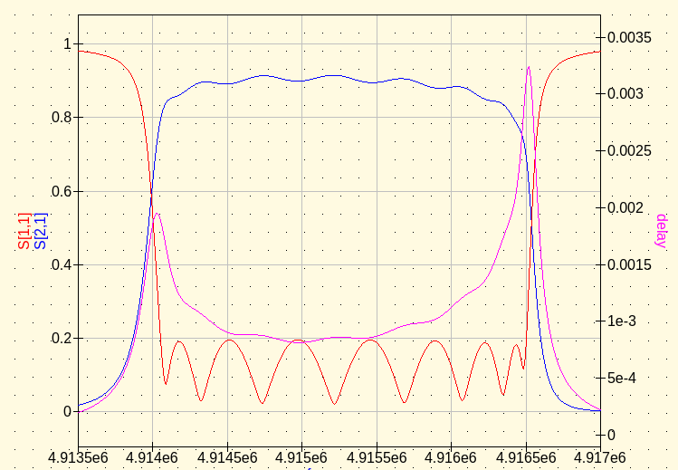
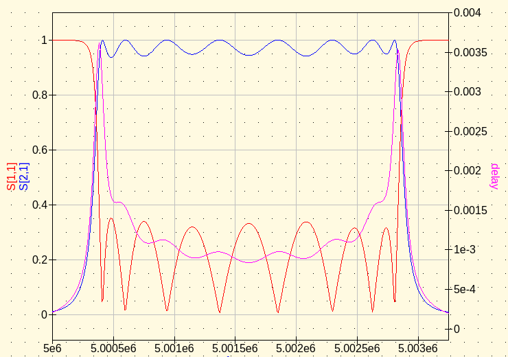
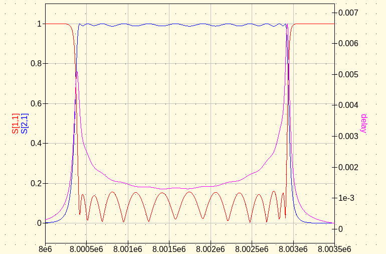
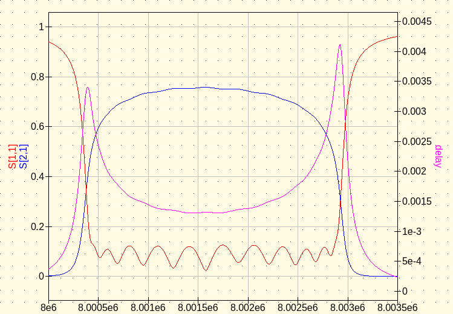

# rffilter.py

Python 3 script for calculating RF filters.
The script requires the numpy library.

For nodal and mesh filters (including crystal filters) the script
prints resonator group delays from Ness as well as 
resonator coupling bandwidths from Dishal.  They are 
also printed when no filter frequency selection type 
is requested, provided the bandwidth is given.

# Library functions

The script provides the following public functions for import.

```
# find filter coefficients or prototype values

g    = lowpass_g(name, n)
q, k = coupling_qk(name, n)
q, k = zverev_k(name, n, qo=np.inf)
qo   = zverev_qo(name, n, qo=np.inf)

# coupling coefficent conversion

q, k = to_coupling_qk(g)
cbw  = to_coupling_bw(q, k, BW)
Q, K = denormalize_qk(q, k, fo, BW)
td   = to_group_delay(q, k, BW)

# wide-band filter design

sij, pij, re = to_lowpass(g, fo, R)
sij, pij, re = to_highpass(g, fo, R)
sij, pij, re = to_bandpass(g, fo, BW, R)
sij, pij, re = to_bandstop(g, fo, BW, R)

# narrow-band filter design

sij, pij, re           = to_nodal(q, k, fo, BW, R=None, L=None)
sij, pij, re           = to_mesh(q, k, fo, BW, R=None, L=None)
sij, pij, re, mesh, fo = to_crystal_mesh(q, k, fo, BW, LM, CP=0, QU=np.inf)
```

Where sij are series component values and pij are the parallel components
values.  re are the end resisitors.

# Command Line

The program takes the following command line options:


```
$ rffilter.py --help
usage: rffilter.py [-h] [--highpass] [--lowpass] [--bandpass] [--nodal]
                   [--mesh] [--crystal] [--expose] [--list-g] [--list-k]
                   [--list-z] [--list-elements] [--n N] [--bw BW] [--g G]
                   [--k K] [--z Z] [--f F] [--ro RO] [--re RE] [--l L]
                   [--qu QU] [--cp CP] [--qo QO]

optional arguments:
  -h, --help       show this help message and exit
  --highpass       generate a highpass filter (default: False)
  --lowpass        generate a lowpass filter (default: False)
  --bandpass       generate a wideband bandpass filter (default: False)
  --nodal          generate a narrow-band nodal bandpass filter (default:
                   False)
  --mesh           generate a narrow-band mesh bandpass filter (default:
                   False)
  --crystal        generate a narrow-band crystal mesh bandpass filter
                   (default: False)
  --expose         expose resonators in spice netlist for nodal and mesh
                   filters (default: False)
  --list-g         list lowpass prototype element response types (default:
                   False)
  --list-k         list q, k coupling response types (default: False)
  --list-z         list Zverev predistored q, k coupling response types
                   (default: False)
  --list-elements  list response type element values (default: False)
  --n N            number of filter poles or resonators (default: None)
  --bw BW          filter bandwidth (default: None)
  --g G            name of lowpass prototype element response (default: None)
  --k K            name of q, k coupling response (default: None)
  --z Z            name of Zverev predistored q, k coupling response (default:
                   None)
  --f F            filter design frequency, can be given in common notation
                   (default: None)
  --ro RO          termination resistors, can be given in common notation
                   (default: None)
  --re RE          end resistors, can be given in common notation (default:
                   None)
  --l L            resonator inductor values, can be given in common notation
                   (default: None)
  --qu QU          unloaded Q of resonators (default: inf)
  --cp CP          parallel capacitance Co of crystals (default: 0)
  --qo QO          maximum qo to show when listing Zverev element values
                   (default: inf)
```


# Examples

## List filter response types


```
$ rffilter.py --list-g
G LOWPASS           POLES
bessel              2  3  4  5  6  7  8  9 10
butterworth         1  2  3  4  5  6  7  8  9 10 11 12 13 14 15
butterworth_singly  1  2  3  4  5  6  7  8  9 10 11 12 13 14 15
chebyshev_0.01      1  2  3  4  5  6  7  8  9 10 11 12 13 14 15
chebyshev_0.1       1  2  3  4  5  6  7  8  9 10 11 12 13 14 15
chebyshev_0.2       1  2  3  4  5  6  7  8  9 10 11 12 13 14 15
chebyshev_0.5       1  2  3  4  5  6  7  8  9 10 11 12 13 14 15
chebyshev_1.0       1  2  3  4  5  6  7  8  9 10 11 12 13 14 15
cohn                1  2  3  4  5  6  7  8  9 10 11 12 13 14 15
gaussian_12         3  4  5  6  7  8  9 10
gaussian_6          3  4  5  6  7  8  9 10
legendre            3  4  5  6  7  8  9 10
linear_phase_0.05   2  3  4  5  6  7  8  9 10
linear_phase_0.5    2  3  4  5  6  7  8  9 10
```


```
$ rffilter.py --list-k
QK COUPLING         POLES
bessel              2  3  4  5  6  7  8
butterworth         2  3  4  5  6  7  8
chebyshev_0.01      2  3  4  5  6  7  8
chebyshev_0.1       2  3  4  5  6  7  8
chebyshev_0.5       2  3  4  5  6  7  8
chebyshev_1.0       2  3  4  5  6  7
gaussian_12         3  4  5  6  7  8
gaussian_6          3  4  5  6  7  8
linear_phase_0.05   2  3  4  5  6  7  8
linear_phase_0.5    2  3  4  5  6  7  8
```


```
$ rffilter.py --list-z
QK ZVEREV           POLES
bessel              2  3  4  5  6  7  8
butterworth         2  3  4  5  6  7  8
chebyshev_0.01      2  3  4  5  6  7  8
chebyshev_0.1       2  3  4  5  6  7  8
chebyshev_0.5       2  3  4  5  6  7  8
gaussian            2  3  4  5  6  7  8
gaussian_12         3  4  5  6  7  8
gaussian_6          3  4  5  6  7  8
legendre            3  4  5  6  7  8
linear_phase_05     2  3  4  5  6  7  8
linear_phase_5      2  3  4  5  6  7  8
```


## List filter element values


```
$ rffilter.py --list-elements --g bessel
N  g0 g1 ... gn gn+1
2  1.0000,0.5755,2.1478,1.0000
3  1.0000,0.3374,0.9705,2.2034,1.0000
4  1.0000,0.2334,0.6725,1.0815,2.2404,1.0000
5  1.0000,0.1743,0.5072,0.8040,1.1110,2.2582,1.0000
6  1.0000,0.1365,0.4002,0.6392,0.8538,1.1126,2.2645,1.0000
7  1.0000,0.1106,0.3259,0.5249,0.7020,0.8690,1.1052,2.2659,1.0000
8  1.0000,0.0919,0.2719,0.4409,0.5936,0.7303,0.8695,1.0956,2.2656,1.0000
9  1.0000,0.0780,0.2313,0.3770,0.5108,0.6306,0.7407,0.8639,1.0863,2.2649,1.0000
10 1.0000,0.0672,0.1998,0.3270,0.4454,0.5528,0.6493,0.7420,0.8561,1.0781,2.2641,1.0000
```


```
$ rffilter.py --list-elements --k butterworth
N  q1 qn k12 k23 k34 k45 k56 ...
2  1.4140,1.4140,0.7070
3  1.0000,1.0000,0.7070,0.7070
4  0.7650,0.7650,0.8410,0.5410,0.8410
5  0.6180,0.6180,1.0000,0.5560,0.5560,1.0000
6  0.5180,0.5180,1.1690,0.6050,0.5180,0.6050,1.1690
7  0.4450,0.4450,1.3420,0.6670,0.5270,0.5270,0.6670,1.3420
8  0.3900,0.3900,1.5190,0.7360,0.5540,0.5100,0.5540,0.7360,1.5190
```


It also works for "--z".  Pass "--qo <qo>" to set the maximum qo.

## Coupling bandwidth and group delay

Print out coupling design information.  CBW is the coupling bandwidth between resonators and the bandwidth of the two resonators at the end.
TD0 and TDn are the group delay
at the center freqency for each resonator looking from either end, see 
Ness' "A Unified Approach to the
Design, Measurement, and Tuning of Coupled-Resonator Filters" in MTT.


```
$ rffilter.py --g chebyshev_0.2 --n 8 --bw 1000
* ij        q,k           TD0           TDn           CBW           Q,K
* 01     1.3804  878.7899e-06             -  724.4277e+00             -
* 12     0.7225  883.3736e-06    3.3734e-03  722.5458e+00             -
* 23     0.5602    2.3407e-03    5.1905e-03  560.2135e+00             -
* 34     0.5349    1.8522e-03    2.8023e-03  534.9422e+00             -
* 45     0.5298    3.8312e-03    3.8313e-03  529.7652e+00             -
* 56     0.5349    2.8023e-03    1.8521e-03  534.9399e+00             -
* 67     0.5602    5.1904e-03    2.3407e-03  560.2141e+00             -
* 78     0.7225    3.3735e-03  883.3482e-06  722.5478e+00             -
* 89     1.3804             -  878.8103e-06  724.4110e+00             -
```


## Nodal narrow-band filters.

Generate a narrow-band filter using LC resonators top coupled by capacitors.
The -expose option exposes the resonators of the filter as ports.
The input port is the port 1 while the port with the highest number
is the output port.  The exposed resonators ports are numbered in increasing order.


```
$ rffilter.py --k chebyshev_0.1 --nodal --expose --f 10e6 --bw 400e3 --n 5 --re 50 --qu 2000 | tee examples/nodal.cir
.SUBCKT F0 1 2 3 4 5
* COMMAND  : rffilter.py --k chebyshev_0.1 --nodal --expose --f 10e6 --bw 400e3 --n 5 --re 50 --qu 2000
* TYPE     : chebyshev_0.1
* FILTER   : nodal
* ORDER    : 5
* FREQ     : 10.0000e+06
* RS       : 50.0
* RL       : 50.0
* BW       : 400.0000e+03
* QL       : 25.0
* QU       : 2000.0
* qo       : 80.0

* ij        q,k           TD0           TDn           CBW           Q,K
* 01     1.3010    2.0706e-06             -  307.4558e+03   32.5250e+00
* 12     0.7030    2.4753e-06    7.7031e-06  281.2000e+03   28.1200e-03
* 23     0.5360    5.6325e-06    4.9506e-06  214.4000e+03   21.4400e-03
* 34     0.5360    4.9506e-06    5.6325e-06  214.4000e+03   21.4400e-03
* 45     0.7030    7.7031e-06    2.4753e-06  281.2000e+03   28.1200e-03
* 56     1.3010             -    2.0706e-06  307.4558e+03   32.5250e+00

L1  1    1001   24.4666e-09
R1  1001 0     768.6395e-06
C2  1    0      10.0619e-09
C3  1    2     291.1272e-12

L4  2    1004   24.4666e-09
R4  1004 0     768.6395e-06
C5  2    0       9.8399e-09
C6  2    3     221.9689e-12

L7  3    1007   24.4666e-09
R7  1007 0     768.6395e-06
C8  3    0       9.9091e-09
C9  3    4     221.9689e-12

L10 4    1010   24.4666e-09
R10 1010 0     768.6395e-06
C11 4    0       9.8399e-09
C12 4    5     291.1272e-12

L13 5    1013   24.4666e-09
R13 1013 0     768.6395e-06
C14 5    0      10.0619e-09
.ends
.end

```


## Mesh narrow-band filters.


```
$ rffilter.py --g butterworth --mesh --f 10e6 --bw 400e3 --n 8 --re 50 | tee examples/mesh.cir
.SUBCKT F0 1 17
* COMMAND  : rffilter.py --g butterworth --mesh --f 10e6 --bw 400e3 --n 8 --re 50
* TYPE     : butterworth
* FILTER   : mesh
* ORDER    : 8
* FREQ     : 10.0000e+06
* RS       : 50.0
* RL       : 50.0
* BW       : 400.0000e+03
* QL       : 25.0
* QU       : inf
* qo       : inf

* ij        q,k           TD0           TDn           CBW           Q,K
* 01     0.3902  621.0226e-09             -    1.0251e+06    9.7550e+00
* 12     1.5187    1.7684e-06    8.1580e-06  607.4909e+03   60.7491e-03
* 23     0.7357    3.2676e-06    8.1580e-06  294.2730e+03   29.4273e-03
* 34     0.5537    4.8904e-06    7.5369e-06  221.4735e+03   22.1473e-03
* 45     0.5098    6.3896e-06    6.3896e-06  203.9152e+03   20.3915e-03
* 56     0.5537    7.5369e-06    4.8904e-06  221.4735e+03   22.1473e-03
* 67     0.7357    8.1580e-06    3.2676e-06  294.2730e+03   29.4273e-03
* 78     1.5187    8.1580e-06    1.7684e-06  607.4909e+03   60.7491e-03
* 89     0.3902             -  621.0226e-09    1.0251e+06    9.7550e+00

L1  1    2       7.7628e-06
C2  2    3      34.7409e-12

C3  3    0     537.1345e-12
L4  3    4       7.7628e-06
C5  4    5      35.8646e-12

C6  5    0       1.1088e-09
L7  5    6       7.7628e-06
C8  6    7      34.4049e-12

C9  7    0       1.4733e-09
L10 7    8       7.7628e-06
C11 8    9      34.0802e-12

C12 9    0       1.6002e-09
L13 9    10      7.7628e-06
C14 10   11     34.0802e-12

C15 11   0       1.4733e-09
L16 11   12      7.7628e-06
C17 12   13     34.4049e-12

C18 13   0       1.1088e-09
L19 13   14      7.7628e-06
C20 14   15     35.8646e-12

C21 15   0     537.1345e-12
L22 15   16      7.7628e-06
C23 16   17     34.7409e-12
.ends
.end

```



## Crystal mesh filters.


### 1. The "Crystal Ladder Filters for All" filter.

Build a 2400 Hz bandwidth crystal filter.  This filter is from an example in Steder's 
"Crystal Ladder Filters for All" paper in QEX.  


```
$ rffilter.py --g chebyshev_0.2 --n 8 --crystal --l 69.7e-3 --f 4913.57e3 --bw 2400 --cp 3.66e-12 | tee examples/xtal.cir
.SUBCKT F0 1 25
* COMMAND  : rffilter.py --g chebyshev_0.2 --n 8 --crystal --l 69.7e-3 --f 4913.57e3 --bw 2400 --cp 3.66e-12
* TYPE     : chebyshev_0.2
* FILTER   : crystal mesh
* ORDER    : 8
* FREQ     : 4.9155e+06
* RS       : 1153.1
* RL       : 1153.0
* CP       : 3.6600e-12
* BW       : 2.4000e+03
* QL       : 2048.1
* QU       : inf
* qo       : inf

* ij        q,k           TD0           TDn           CBW           Q,K
* 01     1.3804  366.1625e-06             -    1.7386e+03    2.8272e+03
* 12     0.7225  368.0723e-06    1.4056e-03    1.7341e+03  352.7866e-06
* 23     0.5602  975.2750e-06    2.1627e-03    1.3445e+03  273.5270e-06
* 34     0.5349  771.7423e-06    1.1676e-03    1.2839e+03  261.1882e-06
* 45     0.5298    1.5964e-03    1.5964e-03    1.2714e+03  258.6605e-06
* 56     0.5349    1.1676e-03  771.7246e-06    1.2839e+03  261.1871e-06
* 67     0.5602    2.1627e-03  975.2995e-06    1.3445e+03  273.5273e-06
* 78     0.7225    1.4056e-03  368.0618e-06    1.7341e+03  352.7876e-06
* 89     1.3804             -  366.1709e-06    1.7386e+03    2.8273e+03

* Xtal    Xtal freq     Mesh freq   Mesh offset      LM Shift
* 1       4913570.0     4914792.1        -672.3      51.439 %
* 2       4913570.0     4915464.4          -0.0      51.439 %
* 3       4913570.0     4915239.2        -225.1      51.439 %
* 4       4913570.0     4915202.7        -261.7      51.439 %
* 5       4913570.0     4915202.7        -261.7      51.439 %
* 6       4913570.0     4915239.2        -225.1      51.439 %
* 7       4913570.0     4915464.4          -0.0      51.439 %
* 8       4913570.0     4914792.1        -672.3      51.439 %

* ij              CKij            CSi
* 12       28.1532e-12    36.3110e-12
* 23       36.3111e-12     7.4808e-06
* 34       38.0265e-12   108.4292e-12
* 45       38.3981e-12    93.2885e-12
* 56       38.0267e-12    93.2876e-12
* 67       36.3111e-12   108.4282e-12
* 78       28.1531e-12     1.0697e-03
* 89                 -    36.3111e-12

C1  1    2      15.0527e-15
L2  2    3      69.7000e-03
C3  1    3       3.6600e-12
C4  3    4      36.3110e-12

C5  4    0      28.1532e-12
C6  4    5      15.0527e-15
L7  5    6      69.7000e-03
C8  4    6       3.6600e-12
C9  6    7       7.4808e-06

C10 7    0      36.3111e-12
C11 7    8      15.0527e-15
L12 8    9      69.7000e-03
C13 7    9       3.6600e-12
C14 9    10    108.4292e-12

C15 10   0      38.0265e-12
C16 10   11     15.0527e-15
L17 11   12     69.7000e-03
C18 10   12      3.6600e-12
C19 12   13     93.2885e-12

C20 13   0      38.3981e-12
C21 13   14     15.0527e-15
L22 14   15     69.7000e-03
C23 13   15      3.6600e-12
C24 15   16     93.2876e-12

C25 16   0      38.0267e-12
C26 16   17     15.0527e-15
L27 17   18     69.7000e-03
C28 16   18      3.6600e-12
C29 18   19    108.4282e-12

C30 19   0      36.3111e-12
C31 19   20     15.0527e-15
L32 20   21     69.7000e-03
C33 19   21      3.6600e-12
C34 21   22      1.0697e-03

C35 22   0      28.1531e-12
C36 22   23     15.0527e-15
L37 23   24     69.7000e-03
C38 22   24      3.6600e-12
C39 24   25     36.3111e-12
.ends
.end

```



Same filter with an unloaded Q of 150000.  See the above Steder article for a figure of the loaded filter's response.


```
$ rffilter.py --g chebyshev_0.2 --n 8 --crystal --l 69.7e-3 --f 4913.57e3 --bw 2400 --cp 3.66e-12 --qu 150000 | tee examples/xtalloss.cir
.SUBCKT F0 1 33
* COMMAND  : rffilter.py --g chebyshev_0.2 --n 8 --crystal --l 69.7e-3 --f 4913.57e3 --bw 2400 --cp 3.66e-12 --qu 150000
* TYPE     : chebyshev_0.2
* FILTER   : crystal mesh
* ORDER    : 8
* FREQ     : 4.9155e+06
* RS       : 1153.1
* RL       : 1153.0
* CP       : 3.6600e-12
* BW       : 2.4000e+03
* QL       : 2048.1
* QU       : 150000.0
* qo       : 73.2

* ij        q,k           TD0           TDn           CBW           Q,K
* 01     1.3804  366.1625e-06             -    1.7386e+03    2.8272e+03
* 12     0.7225  368.0723e-06    1.4056e-03    1.7341e+03  352.7866e-06
* 23     0.5602  975.2750e-06    2.1627e-03    1.3445e+03  273.5270e-06
* 34     0.5349  771.7423e-06    1.1676e-03    1.2839e+03  261.1882e-06
* 45     0.5298    1.5964e-03    1.5964e-03    1.2714e+03  258.6605e-06
* 56     0.5349    1.1676e-03  771.7246e-06    1.2839e+03  261.1871e-06
* 67     0.5602    2.1627e-03  975.2995e-06    1.3445e+03  273.5273e-06
* 78     0.7225    1.4056e-03  368.0618e-06    1.7341e+03  352.7876e-06
* 89     1.3804             -  366.1709e-06    1.7386e+03    2.8273e+03

* Xtal    Xtal freq     Mesh freq   Mesh offset      LM Shift
* 1       4913570.0     4914792.1        -672.3      51.438 %
* 2       4913570.0     4915464.4          -0.0      51.438 %
* 3       4913570.0     4915239.2        -225.1      51.438 %
* 4       4913570.0     4915202.7        -261.7      51.438 %
* 5       4913570.0     4915202.7        -261.7      51.438 %
* 6       4913570.0     4915239.2        -225.1      51.438 %
* 7       4913570.0     4915464.4          -0.0      51.438 %
* 8       4913570.0     4914792.1        -672.3      51.438 %

* ij              CKij            CSi
* 12       28.1534e-12    36.3112e-12
* 23       36.3114e-12     7.5262e-06
* 34       38.0268e-12   108.4299e-12
* 45       38.3984e-12    93.2892e-12
* 56       38.0269e-12    93.2882e-12
* 67       36.3113e-12   108.4289e-12
* 78       28.1533e-12     7.6701e-03
* 89                 -    36.3113e-12

C1  1    2      15.0527e-15
L2  2    3      69.7000e-03
R3  3    4      14.3511e+00
C4  1    4       3.6600e-12
C5  4    5      36.3112e-12

C6  5    0      28.1534e-12
C7  5    6      15.0527e-15
L8  6    7      69.7000e-03
R9  7    8      14.3511e+00
C10 5    8       3.6600e-12
C11 8    9       7.5262e-06

C12 9    0      36.3114e-12
C13 9    10     15.0527e-15
L14 10   11     69.7000e-03
R15 11   12     14.3511e+00
C16 9    12      3.6600e-12
C17 12   13    108.4299e-12

C18 13   0      38.0268e-12
C19 13   14     15.0527e-15
L20 14   15     69.7000e-03
R21 15   16     14.3511e+00
C22 13   16      3.6600e-12
C23 16   17     93.2892e-12

C24 17   0      38.3984e-12
C25 17   18     15.0527e-15
L26 18   19     69.7000e-03
R27 19   20     14.3511e+00
C28 17   20      3.6600e-12
C29 20   21     93.2882e-12

C30 21   0      38.0269e-12
C31 21   22     15.0527e-15
L32 22   23     69.7000e-03
R33 23   24     14.3511e+00
C34 21   24      3.6600e-12
C35 24   25    108.4289e-12

C36 25   0      36.3113e-12
C37 25   26     15.0527e-15
L38 26   27     69.7000e-03
R39 27   28     14.3511e+00
C40 25   28      3.6600e-12
C41 28   29      7.6701e-03

C42 29   0      28.1533e-12
C43 29   30     15.0527e-15
L44 30   31     69.7000e-03
R45 31   32     14.3511e+00
C46 29   32      3.6600e-12
C47 32   33     36.3113e-12
.ends
.end

```



### 2. The Dishal program's owners manual filter.

A crystal filter with multiple crystals of different frequencies.  No parallel capacitance was used.
The filter, less the holder capacitance, is an example from the Dishal program's owners manual.


```
$ rffilter.py --k chebyshev_0.5 --bw 2500 --n 8 --l 70e-3 --crystal --f 5000.680e3,5000.123e3,4999.670e3,5000.235e3,5000.320e3,4999.895e3,5000.010e3,5000.485e3 | tee examples/multiple.cir
.SUBCKT F0 1 25
* COMMAND  : rffilter.py --k chebyshev_0.5 --bw 2500 --n 8 --l 70e-3 --crystal --f 5000.680e3,5000.123e3,4999.670e3,5000.235e3,5000.320e3,4999.895e3,5000.010e3,5000.485e3
* TYPE     : chebyshev_0.5
* FILTER   : crystal mesh
* ORDER    : 8
* FREQ     : 5.0016e+06
* RS       : 615.9
* RL       : 615.9
* BW       : 2.5000e+03
* QL       : 2000.6
* QU       : inf
* qo       : inf

* ij        q,k           TD0           TDn           CBW           Q,K
* 01     1.7850  454.5465e-06             -    1.4006e+03    3.5712e+03
* 12     0.6580  329.4960e-06    1.2579e-03    1.6450e+03  328.8940e-06
* 23     0.5330    1.1473e-03    2.5078e-03    1.3325e+03  266.4141e-06
* 34     0.5150  682.4272e-06    1.0299e-03    1.2875e+03  257.4170e-06
* 45     0.5110    1.8509e-03    1.8509e-03    1.2775e+03  255.4177e-06
* 56     0.5150    1.0299e-03  682.4272e-06    1.2875e+03  257.4170e-06
* 67     0.5330    2.5078e-03    1.1473e-03    1.3325e+03  266.4141e-06
* 78     0.6580    1.2579e-03  329.4960e-06    1.6450e+03  328.8940e-06
* 89     1.7850             -  454.5465e-06    1.4006e+03    3.5712e+03

* Xtal    Xtal freq     Mesh freq   Mesh offset      LM Shift
* 1       5000680.0     5001502.4        -109.2      -0.019 %
* 2       5000123.0     5001611.5          -0.0      -0.030 %
* 3       4999670.0     5000979.6        -631.9      -0.039 %
* 4       5000235.0     5001517.3         -94.3      -0.028 %
* 5       5000320.0     5001602.3          -9.2      -0.026 %
* 6       4999895.0     5001204.7        -406.8      -0.034 %
* 7       5000010.0     5001498.5        -113.0      -0.032 %
* 8       5000485.0     5001307.3        -304.2      -0.023 %

* ij              CKij            CSi
* 12       43.9918e-12   331.4006e-12
* 23       54.3143e-12     3.1175e-03
* 34       56.2120e-12    57.2735e-12
* 45       56.6483e-12   383.8607e-12
* 56       56.2103e-12     3.9144e-09
* 67       54.3137e-12    88.9542e-12
* 78       43.9931e-12   320.1764e-12
* 89                 -   118.9396e-12

C1  1    2      14.4705e-15
L2  2    3      70.0000e-03
C3  3    4     331.4006e-12

C4  4    0      43.9918e-12
C5  4    5      14.4737e-15
L6  5    6      70.0000e-03
C7  6    7       3.1175e-03

C8  7    0      54.3143e-12
C9  7    8      14.4764e-15
L10 8    9      70.0000e-03
C11 9    10     57.2735e-12

C12 10   0      56.2120e-12
C13 10   11     14.4731e-15
L14 11   12     70.0000e-03
C15 12   13    383.8607e-12

C16 13   0      56.6483e-12
C17 13   14     14.4726e-15
L18 14   15     70.0000e-03
C19 15   16      3.9144e-09

C20 16   0      56.2103e-12
C21 16   17     14.4751e-15
L22 17   18     70.0000e-03
C23 18   19     88.9542e-12

C24 19   0      54.3137e-12
C25 19   20     14.4744e-15
L26 20   21     70.0000e-03
C27 21   22    320.1764e-12

C28 22   0      43.9931e-12
C29 22   23     14.4716e-15
L30 23   24     70.0000e-03
C31 24   25    118.9396e-12
.ends
.end

```



The same crystal filter as above but with holder parallel capacitance across the crystals.
The filter is an example from the Dishal program's owners manual.


```
$ rffilter.py --k chebyshev_0.5 --bw 2500 --n 8 --l 70e-3 --crystal --cp 3.7e-12 --f 5000.680e3,5000.123e3,4999.670e3,5000.235e3,5000.320e3,4999.895e3,5000.010e3,5000.485e3 | tee examples/broken.cir
.SUBCKT F0 1 25
* COMMAND  : rffilter.py --k chebyshev_0.5 --bw 2500 --n 8 --l 70e-3 --crystal --cp 3.7e-12 --f 5000.680e3,5000.123e3,4999.670e3,5000.235e3,5000.320e3,4999.895e3,5000.010e3,5000.485e3
* TYPE     : chebyshev_0.5
* FILTER   : crystal mesh
* ORDER    : 8
* FREQ     : 5.0019e+06
* RS       : 810.2
* RL       : 848.6
* CP       : 3.7000e-12
* BW       : 2.5000e+03
* QL       : 2000.8
* QU       : inf
* qo       : inf

* ij        q,k           TD0           TDn           CBW           Q,K
* 01     1.7850  454.5465e-06             -    1.4006e+03    3.5714e+03
* 12     0.6580  329.4960e-06    1.2579e-03    1.6450e+03  328.8729e-06
* 23     0.5330    1.1473e-03    2.5078e-03    1.3325e+03  266.3970e-06
* 34     0.5150  682.4272e-06    1.0299e-03    1.2875e+03  257.4005e-06
* 45     0.5110    1.8509e-03    1.8509e-03    1.2775e+03  255.4013e-06
* 56     0.5150    1.0299e-03  682.4272e-06    1.2875e+03  257.4005e-06
* 67     0.5330    2.5078e-03    1.1473e-03    1.3325e+03  266.3970e-06
* 78     0.6580    1.2579e-03  329.4960e-06    1.6450e+03  328.8729e-06
* 89     1.7850             -  454.5465e-06    1.4006e+03    3.5714e+03

* Xtal    Xtal freq     Mesh freq   Mesh offset      LM Shift
* 1       5000680.0     5001720.4        -212.6      31.532 %
* 2       5000123.0     5001933.1          -0.0      50.551 %
* 3       4999670.0     5001420.7        -512.4      69.235 %
* 4       5000235.0     5001854.0         -79.1      46.409 %
* 5       5000320.0     5001910.5         -22.6      43.378 %
* 6       4999895.0     5001586.4        -346.7      59.545 %
* 7       5000010.0     5001839.8         -93.3      54.910 %
* 8       5000485.0     5001571.5        -361.6      37.758 %

* ij              CKij            CSi
* 12       31.2522e-12   129.3294e-12
* 23       34.0135e-12     1.9320e-03
* 34       35.6968e-12    41.7151e-12
* 45       39.0857e-12   312.2386e-12
* 56       37.1513e-12     1.1173e-09
* 67       34.5347e-12    65.3911e-12
* 78       30.1050e-12   250.3241e-12
* 89                 -    72.6255e-12

C1  1    2      14.4705e-15
L2  2    3      70.0000e-03
C3  1    3       3.7000e-12
C4  3    4     129.3294e-12

C5  4    0      31.2522e-12
C6  4    5      14.4737e-15
L7  5    6      70.0000e-03
C8  4    6       3.7000e-12
C9  6    7       1.9320e-03

C10 7    0      34.0135e-12
C11 7    8      14.4764e-15
L12 8    9      70.0000e-03
C13 7    9       3.7000e-12
C14 9    10     41.7151e-12

C15 10   0      35.6968e-12
C16 10   11     14.4731e-15
L17 11   12     70.0000e-03
C18 10   12      3.7000e-12
C19 12   13    312.2386e-12

C20 13   0      39.0857e-12
C21 13   14     14.4726e-15
L22 14   15     70.0000e-03
C23 13   15      3.7000e-12
C24 15   16      1.1173e-09

C25 16   0      37.1513e-12
C26 16   17     14.4751e-15
L27 17   18     70.0000e-03
C28 16   18      3.7000e-12
C29 18   19     65.3911e-12

C30 19   0      34.5347e-12
C31 19   20     14.4744e-15
L32 20   21     70.0000e-03
C33 19   21      3.7000e-12
C34 21   22    250.3241e-12

C35 22   0      30.1050e-12
C36 22   23     14.4716e-15
L37 23   24     70.0000e-03
C38 22   24      3.7000e-12
C39 24   25     72.6255e-12
.ends
.end

```


### 3. The Design Filter in N6NWP's QEX 1995 article.

N6NWP recommends using the lowest frequency crystal for the reference mesh, while the Dishal program recommends using a crystal in the middle.  Using the middle crystal for the reference mesh seems to require more pulling of the crystal.

The following example uses the lowest crystal for the reference mesh:


```
$ rffilter.py --g chebyshev_0.1 --bw 2500 --n 12 --l .0155 --crystal --cp 5e-12 --f 8000017.0,7999933.0,7999940.0,7999945.0,7999985.0,7999996.0,8000000.0,7999991.0,7999966.0,7999945.0,7999939.0,8000026.0 | tee examples/qexlow.cir
.SUBCKT F0 1 37
* COMMAND  : rffilter.py --g chebyshev_0.1 --bw 2500 --n 12 --l .0155 --crystal --cp 5e-12 --f 8000017.0,7999933.0,7999940.0,7999945.0,7999985.0,7999996.0,8000000.0,7999991.0,7999966.0,7999945.0,7999939.0,8000026.0
* TYPE     : chebyshev_0.1
* FILTER   : crystal mesh
* ORDER    : 12
* FREQ     : 8.0017e+06
* RS       : 240.9
* RL       : 240.7
* CP       : 5.0000e-12
* BW       : 2.5000e+03
* QL       : 3200.7
* QU       : inf
* qo       : inf

* ij        q,k           TD0           TDn           CBW           Q,K
* 01     1.2055  306.9781e-06             -    2.0738e+03    3.8584e+03
* 12     0.7550  370.6146e-06    2.2652e-03    1.8874e+03  235.8743e-06
* 23     0.5644  856.1517e-06    3.0704e-03    1.4111e+03  176.3516e-06
* 34     0.5321  787.7278e-06    2.0388e-03    1.3301e+03  166.2316e-06
* 45     0.5213    1.4281e-03    2.5681e-03    1.3033e+03  162.8824e-06
* 56     0.5172    1.2116e-03    1.6336e-03    1.2929e+03  161.5758e-06
* 67     0.5160    2.0027e-03    2.0027e-03    1.2900e+03  161.2173e-06
* 78     0.5172    1.6336e-03    1.2116e-03    1.2929e+03  161.5769e-06
* 89     0.5214    2.5680e-03    1.4282e-03    1.3034e+03  162.8889e-06
* 910    0.5321    2.0388e-03  787.6913e-06    1.3302e+03  166.2327e-06
* 1011   0.5644    3.0703e-03  856.1785e-06    1.4111e+03  176.3492e-06
* 1112   0.7550    2.2653e-03  370.6053e-06    1.8874e+03  235.8779e-06
* 1213   1.2055             -  306.9762e-06    2.0738e+03    3.8584e+03

* Xtal    Xtal freq     Mesh freq   Mesh offset      LM Shift
* 1       8000017.0     8001110.6        -632.2      19.286 %
* 2       7999933.0     8001738.0          -4.8      20.364 %
* 3       7999940.0     8001469.7        -273.1      20.274 %
* 4       7999945.0     8001418.6        -324.2      20.209 %
* 5       7999985.0     8001435.3        -307.5      19.695 %
* 6       7999996.0     8001436.9        -305.9      19.554 %
* 7       8000000.0     8001440.5        -302.3      19.503 %
* 8       7999991.0     8001439.8        -303.0      19.618 %
* 9       7999966.0     8001437.1        -305.7      19.939 %
* 10      7999945.0     8001473.2        -269.6      20.209 %
* 11      7999939.0     8001742.8          -0.0      20.287 %
* 12      8000026.0     8001118.3        -624.5      19.172 %

* ij              CKij            CSi
* 12       90.3056e-12   135.4164e-12
* 23      120.2890e-12    17.5537e-09
* 34      127.6942e-12   310.8688e-12
* 45      130.6345e-12   262.0353e-12
* 56      132.0511e-12   277.4077e-12
* 67      132.4509e-12   279.2575e-12
* 78      132.1208e-12   282.6373e-12
* 89      130.8184e-12   281.7490e-12
* 910     127.8715e-12   278.4762e-12
* 1011    120.3617e-12   315.0808e-12
* 1112     90.3768e-12    35.5013e-03
* 1213               -   137.2069e-12

C1  1    2      25.5345e-15
L2  2    3      15.5000e-03
C3  1    3       5.0000e-12
C4  3    4     135.4164e-12

C5  4    0      90.3056e-12
C6  4    5      25.5350e-15
L7  5    6      15.5000e-03
C8  4    6       5.0000e-12
C9  6    7      17.5537e-09

C10 7    0     120.2890e-12
C11 7    8      25.5350e-15
L12 8    9      15.5000e-03
C13 7    9       5.0000e-12
C14 9    10    310.8688e-12

C15 10   0     127.6942e-12
C16 10   11     25.5349e-15
L17 11   12     15.5000e-03
C18 10   12      5.0000e-12
C19 12   13    262.0353e-12

C20 13   0     130.6345e-12
C21 13   14     25.5347e-15
L22 14   15     15.5000e-03
C23 13   15      5.0000e-12
C24 15   16    277.4077e-12

C25 16   0     132.0511e-12
C26 16   17     25.5346e-15
L27 17   18     15.5000e-03
C28 16   18      5.0000e-12
C29 18   19    279.2575e-12

C30 19   0     132.4509e-12
C31 19   20     25.5346e-15
L32 20   21     15.5000e-03
C33 19   21      5.0000e-12
C34 21   22    282.6373e-12

C35 22   0     132.1208e-12
C36 22   23     25.5346e-15
L37 23   24     15.5000e-03
C38 22   24      5.0000e-12
C39 24   25    281.7490e-12

C40 25   0     130.8184e-12
C41 25   26     25.5348e-15
L42 26   27     15.5000e-03
C43 25   27      5.0000e-12
C44 27   28    278.4762e-12

C45 28   0     127.8715e-12
C46 28   29     25.5349e-15
L47 29   30     15.5000e-03
C48 28   30      5.0000e-12
C49 30   31    315.0808e-12

C50 31   0     120.3617e-12
C51 31   32     25.5350e-15
L52 32   33     15.5000e-03
C53 31   33      5.0000e-12
C54 33   34     35.5013e-03

C55 34   0      90.3768e-12
C56 34   35     25.5344e-15
L57 35   36     15.5000e-03
C58 34   36      5.0000e-12
C59 36   37    137.2069e-12
.ends
.end

```



The above crystal filter with 120,000 Q crystals:


```
$ rffilter.py --g chebyshev_0.1 --bw 2500 --n 12 --l .0155 --crystal --cp 5e-12 --qu 120000 --f 8000017.0,7999933.0,7999940.0,7999945.0,7999985.0,7999996.0,8000000.0,7999991.0,7999966.0,7999945.0,7999939.0,8000026.0 > examples/qexloss.cir
```



The following example uses a middle crystal for the reference mesh:


```
$ rffilter.py --g chebyshev_0.1 --bw 2500 --n 12 --l .0155 --crystal --cp 5e-12 --f 8000017.0,7999966.0,7999940.0,7999945.0,7999985.0,8000000.0,7999996.0,7999991.0,7999939.0,7999933.0,7999945.0,8000026.0 | tee examples/qexmiddle.cir
.SUBCKT F0 1 37
* COMMAND  : rffilter.py --g chebyshev_0.1 --bw 2500 --n 12 --l .0155 --crystal --cp 5e-12 --f 8000017.0,7999966.0,7999940.0,7999945.0,7999985.0,8000000.0,7999996.0,7999991.0,7999939.0,7999933.0,7999945.0,8000026.0
* TYPE     : chebyshev_0.1
* FILTER   : crystal mesh
* ORDER    : 12
* FREQ     : 8.0018e+06
* RS       : 241.7
* RL       : 241.5
* CP       : 5.0000e-12
* BW       : 2.5000e+03
* QL       : 3200.7
* QU       : inf
* qo       : inf

* ij        q,k           TD0           TDn           CBW           Q,K
* 01     1.2055  306.9781e-06             -    2.0738e+03    3.8585e+03
* 12     0.7550  370.6146e-06    2.2652e-03    1.8874e+03  235.8734e-06
* 23     0.5644  856.1517e-06    3.0704e-03    1.4111e+03  176.3509e-06
* 34     0.5321  787.7278e-06    2.0388e-03    1.3301e+03  166.2310e-06
* 45     0.5213    1.4281e-03    2.5681e-03    1.3033e+03  162.8818e-06
* 56     0.5172    1.2116e-03    1.6336e-03    1.2929e+03  161.5752e-06
* 67     0.5160    2.0027e-03    2.0027e-03    1.2900e+03  161.2167e-06
* 78     0.5172    1.6336e-03    1.2116e-03    1.2929e+03  161.5762e-06
* 89     0.5214    2.5680e-03    1.4282e-03    1.3034e+03  162.8883e-06
* 910    0.5321    2.0388e-03  787.6913e-06    1.3302e+03  166.2321e-06
* 1011   0.5644    3.0703e-03  856.1785e-06    1.4111e+03  176.3485e-06
* 1112   0.7550    2.2653e-03  370.6053e-06    1.8874e+03  235.8770e-06
* 1213   1.2055             -  306.9762e-06    2.0738e+03    3.8584e+03

* Xtal    Xtal freq     Mesh freq   Mesh offset      LM Shift
* 1       8000017.0     8001114.2        -659.3      19.678 %
* 2       7999966.0     8001773.5          -0.0      20.334 %
* 3       7999940.0     8001473.9        -299.6      20.670 %
* 4       7999945.0     8001424.0        -349.4      20.606 %
* 5       7999985.0     8001440.4        -333.0      20.089 %
* 6       8000000.0     8001445.9        -327.5      19.896 %
* 7       7999996.0     8001442.0        -331.4      19.948 %
* 8       7999991.0     8001446.2        -327.3      20.012 %
* 9       7999939.0     8001418.8        -354.7      20.683 %
* 10      7999933.0     8001468.6        -304.8      20.761 %
* 11      7999945.0     8001754.2         -19.3      20.606 %
* 12      8000026.0     8001123.2        -650.3      19.563 %

* ij              CKij            CSi
* 12       90.1686e-12   129.4220e-12
* 23      120.1057e-12   295.9772e-03
* 34      127.2740e-12   282.4796e-12
* 45      130.2051e-12   242.3174e-12
* 56      131.6458e-12   255.3407e-12
* 67      132.0163e-12   260.0475e-12
* 78      131.6590e-12   256.8588e-12
* 89      130.1998e-12   259.9932e-12
* 910     127.1843e-12   238.5581e-12
* 1011    119.9269e-12   277.4025e-12
* 1112     90.1090e-12     4.3862e-09
* 1213               -   131.3387e-12

C1  1    2      25.5345e-15
L2  2    3      15.5000e-03
C3  1    3       5.0000e-12
C4  3    4     129.4220e-12

C5  4    0      90.1686e-12
C6  4    5      25.5348e-15
L7  5    6      15.5000e-03
C8  4    6       5.0000e-12
C9  6    7     295.9772e-03

C10 7    0     120.1057e-12
C11 7    8      25.5350e-15
L12 8    9      15.5000e-03
C13 7    9       5.0000e-12
C14 9    10    282.4796e-12

C15 10   0     127.2740e-12
C16 10   11     25.5349e-15
L17 11   12     15.5000e-03
C18 10   12      5.0000e-12
C19 12   13    242.3174e-12

C20 13   0     130.2051e-12
C21 13   14     25.5347e-15
L22 14   15     15.5000e-03
C23 13   15      5.0000e-12
C24 15   16    255.3407e-12

C25 16   0     131.6458e-12
C26 16   17     25.5346e-15
L27 17   18     15.5000e-03
C28 16   18      5.0000e-12
C29 18   19    260.0475e-12

C30 19   0     132.0163e-12
C31 19   20     25.5346e-15
L32 20   21     15.5000e-03
C33 19   21      5.0000e-12
C34 21   22    256.8588e-12

C35 22   0     131.6590e-12
C36 22   23     25.5346e-15
L37 23   24     15.5000e-03
C38 22   24      5.0000e-12
C39 24   25    259.9932e-12

C40 25   0     130.1998e-12
C41 25   26     25.5350e-15
L42 26   27     15.5000e-03
C43 25   27      5.0000e-12
C44 27   28    238.5581e-12

C45 28   0     127.1843e-12
C46 28   29     25.5350e-15
L47 29   30     15.5000e-03
C48 28   30      5.0000e-12
C49 30   31    277.4025e-12

C50 31   0     119.9269e-12
C51 31   32     25.5349e-15
L52 32   33     15.5000e-03
C53 31   33      5.0000e-12
C54 33   34      4.3862e-09

C55 34   0      90.1090e-12
C56 34   35     25.5344e-15
L57 35   36     15.5000e-03
C58 34   36      5.0000e-12
C59 36   37    131.3387e-12
.ends
.end

```


## Lowpass and highpass filters.


```
$ rffilter.py --g butterworth --lowpass --f 10e6 --n 5 --re 50
.SUBCKT F0 1 3
* COMMAND  : rffilter.py --g butterworth --lowpass --f 10e6 --n 5 --re 50
* TYPE     : butterworth
* FILTER   : lowpass
* ORDER    : 5
* FREQ     : 10.0000e+06
* RS       : 50.0
* RL       : 50.0

C1  1    0     196.7155e-12
L2  1    2       1.2876e-06

C3  2    0     636.6198e-12
L4  2    3       1.2876e-06

C5  3    0     196.7155e-12
.ends
.end

.SUBCKT F0 1 4
* COMMAND  : rffilter.py --g butterworth --lowpass --f 10e6 --n 5 --re 50
* TYPE     : butterworth
* FILTER   : lowpass
* ORDER    : 5
* FREQ     : 10.0000e+06
* RS       : 50.0
* RL       : 50.0

L1  1    2     491.7888e-09

C2  2    0     515.0254e-12
L3  2    3       1.5915e-06

C4  3    0     515.0254e-12
L5  3    4     491.7888e-09
.ends
.end

```


## Wide band bandpass filters.


```
$ rffilter.py --g butterworth --bandpass --f 10e6 --bw 1e6 --n 4 --re 50
.SUBCKT F0 1 5
* COMMAND  : rffilter.py --g butterworth --bandpass --f 10e6 --bw 1e6 --n 4 --re 50
* TYPE     : butterworth
* FILTER   : bandpass
* ORDER    : 4
* FREQ     : 10.0000e+06
* RS       : 50.0
* RL       : 50.0
* BW       : 1.0000e+06
* QL       : 10.0
* QU       : inf
* qo       : inf

L1  1    0     103.9685e-09
C2  1    0       2.4363e-09
L3  1    2      14.7043e-06
C4  2    3      17.2264e-12

L5  3    0      43.0661e-09
C6  3    0       5.8817e-09
L7  3    4       6.0909e-06
C8  4    5      41.5874e-12
.ends
.end

.SUBCKT F0 1 5
* COMMAND  : rffilter.py --g butterworth --bandpass --f 10e6 --bw 1e6 --n 4 --re 50
* TYPE     : butterworth
* FILTER   : bandpass
* ORDER    : 4
* FREQ     : 10.0000e+06
* RS       : 50.0
* RL       : 50.0
* BW       : 1.0000e+06
* QL       : 10.0
* QU       : inf
* qo       : inf

L1  1    2       6.0909e-06
C2  2    3      41.5874e-12

L3  3    0      43.0661e-09
C4  3    0       5.8817e-09
L5  3    4      14.7043e-06
C6  4    5      17.2264e-12

L7  5    0     103.9685e-09
C8  5    0       2.4363e-09
.ends
.end

```


## Use of Zverev filter tables with an unloaded Q.


```
$ rffilter.py --z butterworth --nodal --qu 2500 --bw 1e6 --f 10e6 --n 3 --re 50
.SUBCKT F0 1 3
* COMMAND  : rffilter.py --z butterworth --nodal --qu 2500 --bw 1e6 --f 10e6 --n 3 --re 50
* TYPE     : butterworth
* FILTER   : nodal
* ORDER    : 3
* FREQ     : 10.0000e+06
* RS       : 50.0
* RL       : 50.0
* BW       : 1.0000e+06
* QL       : 10.0
* QU       : 2500.0
* qo       : 250.0
* qmin     : 20.0

* ij        q,k           TD0           TDn           CBW           Q,K
* 01     0.8041  511.9060e-09             -    1.2436e+06    8.0410e+00
* 12     0.7687    1.3399e-06    1.5619e-06  768.7000e+03   76.8700e-03
* 23     0.6582    1.2101e-06    1.0381e-06  658.2000e+03   65.8200e-03
* 34     1.4156             -  901.1989e-09  706.4142e+03   14.1560e+00

L1  1    1001   98.9646e-09
R1  1001 0       2.4873e-03
C2  1    0       2.3628e-09
C3  1    2     196.7511e-12

L4  2    1004   98.9646e-09
R4  1004 0       2.4873e-03
C5  2    0       2.1393e-09
C6  2    3     223.5287e-12

L7  3    1007   56.2147e-09
R7  1007 0       1.4128e-03
C8  3    0       4.2825e-09
.ends
.end

```


```
$ rffilter.py --z bessel --nodal --qu 2500 --bw 1e6 --f 10e6 --n 8 --re 50
.SUBCKT F0 1 8
* COMMAND  : rffilter.py --z bessel --nodal --qu 2500 --bw 1e6 --f 10e6 --n 8 --re 50
* TYPE     : bessel
* FILTER   : nodal
* ORDER    : 8
* FREQ     : 10.0000e+06
* RS       : 50.0
* RL       : 50.0
* BW       : 1.0000e+06
* QL       : 10.0
* QU       : 2500.0
* qo       : 250.0
* qmin     : 11.2

* ij        q,k           TD0           TDn           CBW           Q,K
* 01     0.0975   62.0704e-09             -   10.2564e+06  975.0000e-03
* 12     5.9216  186.2076e-09    1.8516e-06    5.9216e+06  592.1600e-03
* 23     2.7188  356.5183e-09    2.1501e-06    2.7188e+06  271.8800e-03
* 34     1.8573  585.2213e-09    1.7763e-06    1.8573e+06  185.7300e-03
* 45     1.4616  831.9798e-09    1.9966e-06    1.4616e+06  146.1600e-03
* 56     1.2253    1.1530e-06    1.4191e-06    1.2253e+06  122.5300e-03
* 67     1.0138    1.5265e-06    1.6676e-06    1.0138e+06  101.3800e-03
* 78     0.6333    2.6079e-06  842.4306e-09  633.3000e+03   63.3300e-03
* 89     1.8842             -    1.1995e-06  530.7292e+03   18.8420e+00

L1  1    1001  816.1792e-09
R1  1001 0      20.5128e-03
C2  1    0     126.5740e-12
C3  1    2     183.7781e-12

L4  2    1004  816.1792e-09
R4  1004 0      20.5128e-03
C5  2    0      42.1955e-12
C6  2    3      84.3785e-12

L7  3    1007  816.1792e-09
R7  1007 0      20.5128e-03
C8  3    0     168.3319e-12
C9  3    4      57.6417e-12

L10 4    1010  816.1792e-09
R10 1010 0      20.5128e-03
C11 4    0     207.3494e-12
C12 4    5      45.3611e-12

L13 5    1013  816.1792e-09
R13 1013 0      20.5128e-03
C14 5    0     226.9636e-12
C15 5    6      38.0274e-12

L16 6    1016  816.1792e-09
R16 1016 0      20.5128e-03
C17 6    0     240.8612e-12
C18 6    7      31.4635e-12

L19 7    1019  816.1792e-09
R19 1019 0      20.5128e-03
C20 7    0     192.4863e-12
C21 7    8      86.4023e-12

L22 8    1022   42.2341e-09
R22 1022 0       1.0615e-03
C23 8    0       5.9112e-09
.ends
.end

.SUBCKT F0 1 8
* COMMAND  : rffilter.py --z bessel --nodal --qu 2500 --bw 1e6 --f 10e6 --n 8 --re 50
* TYPE     : bessel
* FILTER   : nodal
* ORDER    : 8
* FREQ     : 10.0000e+06
* RS       : 50.0
* RL       : 50.0
* BW       : 1.0000e+06
* QL       : 10.0
* QU       : 2500.0
* qo       : 250.0
* qmin     : 11.2

* ij        q,k           TD0           TDn           CBW           Q,K
* 01     0.1192   75.8851e-09             -    8.3893e+06    1.1920e+00
* 12     4.8959  222.8121e-09    2.6848e-06    4.8959e+06  489.5900e-03
* 23     2.3142  415.5257e-09    1.4829e-06    2.3142e+06  231.4200e-03
* 34     1.6364  668.4290e-09    2.6052e-06    1.6364e+06  163.6400e-03
* 45     1.3128  943.2432e-09    1.2707e-06    1.3128e+06  131.2800e-03
* 56     1.1222    1.2783e-06    2.2486e-06    1.1222e+06  112.2200e-03
* 67     0.6417    2.5571e-06  846.2446e-09  641.7000e+03   64.1700e-03
* 78     0.9493    1.5569e-06    1.6945e-06  949.3000e+03   94.9300e-03
* 89     0.4169             -  265.4068e-09    2.3987e+06    4.1690e+00

L1  1    1001  667.5962e-09
R1  1001 0      16.7785e-03
C2  1    0     193.6625e-12
C3  1    2     185.7629e-12

L4  2    1004  667.5962e-09
R4  1004 0      16.7785e-03
C5  2    0     105.8559e-12
C6  2    3      87.8066e-12

L7  3    1007  667.5962e-09
R7  1007 0      16.7785e-03
C8  3    0     229.5296e-12
C9  3    4      62.0892e-12

L10 4    1010  667.5962e-09
R10 1010 0      16.7785e-03
C11 4    0     267.5252e-12
C12 4    5      49.8110e-12

L13 5    1013  667.5962e-09
R13 1013 0      16.7785e-03
C14 5    0     287.0353e-12
C15 5    6      42.5791e-12

L16 6    1016  667.5962e-09
R16 1016 0      16.7785e-03
C17 6    0     312.4985e-12
C18 6    7      24.3477e-12

L19 7    1019  667.5962e-09
R19 1019 0      16.7785e-03
C20 7    0     287.7168e-12
C21 7    8      67.3609e-12

L22 8    1022  190.8790e-09
R22 1022 0       4.7973e-03
C23 8    0       1.2597e-09
.ends
.end

.SUBCKT F0 1 8
* COMMAND  : rffilter.py --z bessel --nodal --qu 2500 --bw 1e6 --f 10e6 --n 8 --re 50
* TYPE     : bessel
* FILTER   : nodal
* ORDER    : 8
* FREQ     : 10.0000e+06
* RS       : 50.0
* RL       : 50.0
* BW       : 1.0000e+06
* QL       : 10.0
* QU       : 2500.0
* qo       : 250.0
* qmin     : 11.2

* ij        q,k           TD0           TDn           CBW           Q,K
* 01     0.1474   93.8378e-09             -    6.7843e+06    1.4740e+00
* 12     4.0137  268.0975e-09    1.5752e-06    4.0137e+06  401.3700e-03
* 23     1.9766  480.7655e-09    2.5273e-06    1.9766e+06  197.6600e-03
* 34     1.4331  778.1060e-09    1.4780e-06    1.4331e+06  143.3100e-03
* 45     1.2361    1.0009e-06    2.2687e-06    1.2361e+06  123.6100e-03
* 56     0.6818    2.4545e-06    1.0769e-06  681.8000e+03   68.1800e-03
* 67     0.6825    1.5199e-06    1.7766e-06  682.5000e+03   68.2500e-03
* 78     2.1762    2.6194e-06  537.9182e-09    2.1762e+06  217.6200e-03
* 89     0.2499             -  159.0913e-09    4.0016e+06    2.4990e+00

L1  1    1001  539.8743e-09
R1  1001 0      13.5685e-03
C2  1    0     280.8705e-12
C3  1    2     188.3183e-12

L4  2    1004  539.8743e-09
R4  1004 0      13.5685e-03
C5  2    0     188.1306e-12
C6  2    3      92.7399e-12

L7  3    1007  539.8743e-09
R7  1007 0      13.5685e-03
C8  3    0     309.2095e-12
C9  3    4      67.2394e-12

L10 4    1010  539.8743e-09
R10 1010 0      13.5685e-03
C11 4    0     343.9529e-12
C12 4    5      57.9964e-12

L13 5    1013  539.8743e-09
R13 1013 0      13.5685e-03
C14 5    0     379.2031e-12
C15 5    6      31.9893e-12

L16 6    1016  539.8743e-09
R16 1016 0      13.5685e-03
C17 6    0     405.1773e-12
C18 6    7      32.0221e-12

L19 7    1019  539.8743e-09
R19 1019 0      13.5685e-03
C20 7    0     304.2189e-12
C21 7    8     132.9477e-12

L22 8    1022  318.4373e-09
R22 1022 0       8.0032e-03
C23 8    0     662.5087e-12
.ends
.end

.SUBCKT F0 1 8
* COMMAND  : rffilter.py --z bessel --nodal --qu 2500 --bw 1e6 --f 10e6 --n 8 --re 50
* TYPE     : bessel
* FILTER   : nodal
* ORDER    : 8
* FREQ     : 10.0000e+06
* RS       : 50.0
* RL       : 50.0
* BW       : 1.0000e+06
* QL       : 10.0
* QU       : 2500.0
* qo       : 250.0
* qmin     : 11.2

* ij        q,k           TD0           TDn           CBW           Q,K
* 01     0.2034  129.4885e-09             -    4.9164e+06    2.0340e+00
* 12     3.1367  318.1143e-09    2.6241e-06    3.1367e+06  313.6700e-03
* 23     1.6246  612.1961e-09    1.5171e-06    1.6246e+06  162.4600e-03
* 34     1.3923  751.2365e-09    2.4902e-06    1.3923e+06  139.2300e-03
* 45     0.7691    2.1941e-06    1.2094e-06  769.1000e+03   76.9100e-03
* 56     0.6027    1.4565e-06    1.9911e-06  602.7000e+03   60.2700e-03
* 67     1.2931    2.5378e-06  790.5759e-09    1.2931e+06  129.3100e-03
* 78     3.2425    1.5687e-06  355.3453e-09    3.2425e+06  324.2500e-03
* 89     0.1704             -  108.4800e-09    5.8685e+06    1.7040e+00

L1  1    1001  391.2363e-09
R1  1001 0       9.8328e-03
C2  1    0     444.3591e-12
C3  1    2     203.0832e-12

L4  2    1004  391.2363e-09
R4  1004 0       9.8328e-03
C5  2    0     339.1756e-12
C6  2    3     105.1835e-12

L7  3    1007  391.2363e-09
R7  1007 0       9.8328e-03
C8  3    0     452.1154e-12
C9  3    4      90.1434e-12

L10 4    1010  391.2363e-09
R10 1010 0       9.8328e-03
C11 4    0     507.5041e-12
C12 4    5      49.7948e-12

L13 5    1013  391.2363e-09
R13 1013 0       9.8328e-03
C14 5    0     558.6262e-12
C15 5    6      39.0213e-12

L16 6    1016  391.2363e-09
R16 1016 0       9.8328e-03
C17 6    0     524.7002e-12
C18 6    7      83.7208e-12

L19 7    1019  391.2363e-09
R19 1019 0       9.8328e-03
C20 7    0     371.5715e-12
C21 7    8     192.1500e-12

L22 8    1022  467.0039e-09
R22 1022 0      11.7371e-03
C23 8    0     350.2500e-12
.ends
.end

.SUBCKT F0 1 8
* COMMAND  : rffilter.py --z bessel --nodal --qu 2500 --bw 1e6 --f 10e6 --n 8 --re 50
* TYPE     : bessel
* FILTER   : nodal
* ORDER    : 8
* FREQ     : 10.0000e+06
* RS       : 50.0
* RL       : 50.0
* BW       : 1.0000e+06
* QL       : 10.0
* QU       : 2500.0
* qo       : 250.0
* qmin     : 11.2

* ij        q,k           TD0           TDn           CBW           Q,K
* 01     0.1332   84.7978e-09             -    7.5075e+06    1.3320e+00
* 12     4.3253  255.4721e-09    1.5909e-06    4.3253e+06  432.5300e-03
* 23     2.0981  445.1809e-09    2.4956e-06    2.0981e+06  209.8100e-03
* 34     1.4629  780.9646e-09    1.4955e-06    1.4629e+06  146.2900e-03
* 45     1.1695    1.0091e-06    2.2684e-06    1.1695e+06  116.9500e-03
* 56     0.6307    2.5878e-06    1.0903e-06  630.7000e+03   63.0700e-03
* 67     0.7436    1.4147e-06    1.8011e-06  743.6000e+03   74.3600e-03
* 78     2.1384    2.8063e-06  456.1605e-09    2.1384e+06  213.8400e-03
* 89     0.3052             -  194.2964e-09    3.2765e+06    3.0520e+00

L1  1    1001  597.4285e-09
R1  1001 0      15.0150e-03
C2  1    0     240.6009e-12
C3  1    2     183.3879e-12

L4  2    1004  597.4285e-09
R4  1004 0      15.0150e-03
C5  2    0     151.6438e-12
C6  2    3      88.9571e-12

L7  3    1007  597.4285e-09
R7  1007 0      15.0150e-03
C8  3    0     273.0064e-12
C9  3    4      62.0253e-12

L10 4    1010  597.4285e-09
R10 1010 0      15.0150e-03
C11 4    0     312.3780e-12
C12 4    5      49.5855e-12

L13 5    1013  597.4285e-09
R13 1013 0      15.0150e-03
C14 5    0     347.6623e-12
C15 5    6      26.7410e-12

L16 6    1016  597.4285e-09
R16 1016 0      15.0150e-03
C17 6    0     365.7200e-12
C18 6    7      31.5278e-12

L19 7    1019  597.4285e-09
R19 1019 0      15.0150e-03
C20 7    0     255.2201e-12
C21 7    8     137.2409e-12

L22 8    1022  260.7388e-09
R22 1022 0       6.5531e-03
C23 8    0     834.2409e-12
.ends
.end

.SUBCKT F0 1 8
* COMMAND  : rffilter.py --z bessel --nodal --qu 2500 --bw 1e6 --f 10e6 --n 8 --re 50
* TYPE     : bessel
* FILTER   : nodal
* ORDER    : 8
* FREQ     : 10.0000e+06
* RS       : 50.0
* RL       : 50.0
* BW       : 1.0000e+06
* QL       : 10.0
* QU       : 2500.0
* qo       : 250.0
* qmin     : 11.2

* ij        q,k           TD0           TDn           CBW           Q,K
* 01     0.1772  112.8090e-09             -    5.6433e+06    1.7720e+00
* 12     3.3376  322.5135e-09    2.5625e-06    3.3376e+06  333.7600e-03
* 23     1.0876    1.1752e-06    1.9523e-06    1.0876e+06  108.7600e-03
* 34     1.3420  534.3404e-09    2.5140e-06    1.3420e+06  134.2000e-03
* 45     0.6980    5.1022e-06    1.2016e-06  698.0000e+03   69.8000e-03
* 56     0.6410  785.5151e-09    2.0576e-06  641.0000e+03   64.1000e-03
* 67     1.3675    5.9651e-06  708.4631e-09    1.3675e+06  136.7500e-03
* 78     2.9724  838.6790e-09  370.6546e-09    2.9724e+06  297.2400e-03
* 89     0.1944             -  123.7589e-09    5.1440e+06    1.9440e+00

L1  1    1001  449.0828e-09
R1  1001 0      11.2867e-03
C2  1    0     375.7894e-12
C3  1    2     188.2557e-12

L4  2    1004  449.0828e-09
R4  1004 0      11.2867e-03
C5  2    0     314.4439e-12
C6  2    3      61.3455e-12

L7  3    1007  449.0828e-09
R7  1007 0      11.2867e-03
C8  3    0     427.0047e-12
C9  3    4      75.6949e-12

L10 4    1010  449.0828e-09
R10 1010 0      11.2867e-03
C11 4    0     448.9799e-12
C12 4    5      39.3703e-12

L13 5    1013  449.0828e-09
R13 1013 0      11.2867e-03
C14 5    0     488.5195e-12
C15 5    6      36.1553e-12

L16 6    1016  449.0828e-09
R16 1016 0      11.2867e-03
C17 6    0     450.7567e-12
C18 6    7      77.1332e-12

L19 7    1019  449.0828e-09
R19 1019 0      11.2867e-03
C20 7    0     311.3067e-12
C21 7    8     175.6052e-12

L22 8    1022  409.3491e-09
R22 1022 0      10.2881e-03
C23 8    0     443.1892e-12
.ends
.end

.SUBCKT F0 1 8
* COMMAND  : rffilter.py --z bessel --nodal --qu 2500 --bw 1e6 --f 10e6 --n 8 --re 50
* TYPE     : bessel
* FILTER   : nodal
* ORDER    : 8
* FREQ     : 10.0000e+06
* RS       : 50.0
* RL       : 50.0
* BW       : 1.0000e+06
* QL       : 10.0
* QU       : 2500.0
* qo       : 250.0
* qmin     : 11.2

* ij        q,k           TD0           TDn           CBW           Q,K
* 01     0.2476  157.6271e-09             -    4.0388e+06    2.4760e+00
* 12     2.5022  410.6629e-09    1.5610e-06    2.5022e+06  250.2200e-03
* 23     1.5729  556.5349e-09    2.5503e-06    1.5729e+06  157.2900e-03
* 34     0.7831    2.0674e-06    1.3976e-06  783.1000e+03   78.3100e-03
* 45     0.6019    1.2318e-06    2.1541e-06  601.9000e+03   60.1900e-03
* 56     1.1206    2.5454e-06  984.1625e-09    1.1206e+06  112.0600e-03
* 67     1.7580    1.5061e-06  555.5318e-09    1.7580e+06  175.8000e-03
* 78     3.8868    2.6431e-06  284.3463e-09    3.8868e+06  388.6800e-03
* 89     0.1482             -   94.3471e-09    6.7476e+06    1.4820e+00

L1  1    1001  321.3953e-09
R1  1001 0       8.0775e-03
C2  1    0     590.9281e-12
C3  1    2     197.2072e-12

L4  2    1004  321.3953e-09
R4  1004 0       8.0775e-03
C5  2    0     466.9623e-12
C6  2    3     123.9658e-12

L7  3    1007  321.3953e-09
R7  1007 0       8.0775e-03
C8  3    0     602.4506e-12
C9  3    4      61.7189e-12

L10 4    1010  321.3953e-09
R10 1010 0       8.0775e-03
C11 4    0     678.9785e-12
C12 4    5      47.4379e-12

L13 5    1013  321.3953e-09
R13 1013 0       8.0775e-03
C14 5    0     652.3790e-12
C15 5    6      88.3184e-12

L16 6    1016  321.3953e-09
R16 1016 0       8.0775e-03
C17 6    0     561.2627e-12
C18 6    7     138.5542e-12

L19 7    1019  321.3953e-09
R19 1019 0       8.0775e-03
C20 7    0     412.5847e-12
C21 7    8     236.9964e-12

L22 8    1022  536.9600e-09
R22 1022 0      13.4953e-03
C23 8    0     234.7389e-12
.ends
.end

.SUBCKT F0 1 8
* COMMAND  : rffilter.py --z bessel --nodal --qu 2500 --bw 1e6 --f 10e6 --n 8 --re 50
* TYPE     : bessel
* FILTER   : nodal
* ORDER    : 8
* FREQ     : 10.0000e+06
* RS       : 50.0
* RL       : 50.0
* BW       : 1.0000e+06
* QL       : 10.0
* QU       : 2500.0
* qo       : 250.0
* qmin     : 11.2

* ij        q,k           TD0           TDn           CBW           Q,K
* 01     0.4606  293.2271e-09             -    2.1711e+06    4.6060e+00
* 12     2.1216  307.0642e-09    2.6107e-06    2.1216e+06  212.1600e-03
* 23     0.9547    1.7413e-06    1.5248e-06  954.7000e+03   95.4700e-03
* 34     0.5810    1.1362e-06    2.3019e-06  581.0000e+03   58.1000e-03
* 45     0.9670    2.2641e-06    1.2332e-06  967.0000e+03   96.7000e-03
* 56     1.4066    1.5280e-06  776.8161e-09    1.4066e+06  140.6600e-03
* 67     2.1941    2.4789e-06  445.9809e-09    2.1941e+06  219.4100e-03
* 78     4.9228    1.6059e-06  226.2682e-09    4.9228e+06  492.2800e-03
* 89     0.1161             -   73.9116e-09    8.6133e+06    1.1610e+00

L1  1    1001  172.7692e-09
R1  1001 0       4.3422e-03
C2  1    0       1.1551e-09
C3  1    2     311.0553e-12

L4  2    1004  172.7692e-09
R4  1004 0       4.3422e-03
C5  2    0       1.0151e-09
C6  2    3     139.9719e-12

L7  3    1007  172.7692e-09
R7  1007 0       4.3422e-03
C8  3    0       1.2410e-09
C9  3    4      85.1825e-12

L10 4    1010  172.7692e-09
R10 1010 0       4.3422e-03
C11 4    0       1.2392e-09
C12 4    5     141.7753e-12

L13 5    1013  172.7692e-09
R13 1013 0       4.3422e-03
C14 5    0       1.1181e-09
C15 5    6     206.2266e-12

L16 6    1016  172.7692e-09
R16 1016 0       4.3422e-03
C17 6    0     938.2240e-12
C18 6    7     321.6848e-12

L19 7    1019  172.7692e-09
R19 1019 0       4.3422e-03
C20 7    0     782.0905e-12
C21 7    8     362.3601e-12

L22 8    1022  685.4218e-09
R22 1022 0      17.2265e-03
C23 8    0       7.1977e-12
.ends
.end

```


## More examples


```
$ rffilter.py --k butterworth --nodal --f 10e6 --bw 1e6 --n 5 --re 50
.SUBCKT F0 1 5
* COMMAND  : rffilter.py --k butterworth --nodal --f 10e6 --bw 1e6 --n 5 --re 50
* TYPE     : butterworth
* FILTER   : nodal
* ORDER    : 5
* FREQ     : 10.0000e+06
* RS       : 50.0
* RL       : 50.0
* BW       : 1.0000e+06
* QL       : 10.0
* QU       : inf
* qo       : inf

* ij        q,k           TD0           TDn           CBW           Q,K
* 01     0.6180  393.4310e-09             -    1.6181e+06    6.1800e+00
* 12     1.0000    1.0301e-06    2.0595e-06    1.0000e+06  100.0000e-03
* 23     0.5560    1.6661e-06    2.0603e-06  556.0000e+03   55.6000e-03
* 34     0.5560    2.0603e-06    1.6661e-06  556.0000e+03   55.6000e-03
* 45     1.0000    2.0595e-06    1.0301e-06    1.0000e+06  100.0000e-03
* 56     0.6180             -  393.4310e-09    1.6181e+06    6.1800e+00

L1  1    0     128.7661e-09
C2  1    0       1.7704e-09
C3  1    2     196.7155e-12

L4  2    0     128.7661e-09
C5  2    0       1.6611e-09
C6  2    3     109.3738e-12

L7  3    0     128.7661e-09
C8  3    0       1.7484e-09
C9  3    4     109.3738e-12

L10 4    0     128.7661e-09
C11 4    0       1.6611e-09
C12 4    5     196.7155e-12

L13 5    0     128.7661e-09
C14 5    0       1.7704e-09
.ends
.end

```


```
$ rffilter.py --g butterworth --nodal --f 10e6 --bw 400e3 --n 5 --l 100e-9,100e-9,100e-9,100e-9,100e-9
.SUBCKT F0 1 5
* COMMAND  : rffilter.py --g butterworth --nodal --f 10e6 --bw 400e3 --n 5 --l 100e-9,100e-9,100e-9,100e-9,100e-9
* TYPE     : butterworth
* FILTER   : nodal
* ORDER    : 5
* FREQ     : 10.0000e+06
* RS       : 97.1
* RL       : 97.1
* BW       : 400.0000e+03
* QL       : 25.0
* QU       : inf
* qo       : inf

* ij        q,k           TD0           TDn           CBW           Q,K
* 01     0.6180  983.5775e-09             -  647.2492e+03   15.4500e+00
* 12     1.0000    2.5751e-06    5.1503e-06  400.0152e+03   40.0015e-03
* 23     0.5559    4.1667e-06    5.1503e-06  222.3595e+03   22.2360e-03
* 34     0.5559    5.1503e-06    4.1667e-06  222.3595e+03   22.2360e-03
* 45     1.0000    5.1503e-06    2.5751e-06  400.0152e+03   40.0015e-03
* 56     0.6180             -  983.5775e-09  647.2492e+03   15.4500e+00

L1  1    0     100.0000e-09
C2  1    0       2.4317e-09
C3  1    2     101.3250e-12

L4  2    0     100.0000e-09
C5  2    0       2.3754e-09
C6  2    3      56.3243e-12

L7  3    0     100.0000e-09
C8  3    0       2.4204e-09
C9  3    4      56.3243e-12

L10 4    0     100.0000e-09
C11 4    0       2.3754e-09
C12 4    5     101.3250e-12

L13 5    0     100.0000e-09
C14 5    0       2.4317e-09
.ends
.end

```


```
$ rffilter.py --g butterworth --nodal --f 10e6 --bw 400e3 --n 5 --re 100,120
.SUBCKT F0 1 5
* COMMAND  : rffilter.py --g butterworth --nodal --f 10e6 --bw 400e3 --n 5 --re 100,120
* TYPE     : butterworth
* FILTER   : nodal
* ORDER    : 5
* FREQ     : 10.0000e+06
* RS       : 100.0
* RL       : 120.0
* BW       : 400.0000e+03
* QL       : 25.0
* QU       : inf
* qo       : inf

* ij        q,k           TD0           TDn           CBW           Q,K
* 01     0.6180  983.5775e-09             -  647.2492e+03   15.4500e+00
* 12     1.0000    2.5751e-06    5.1503e-06  400.0152e+03   40.0015e-03
* 23     0.5559    4.1667e-06    5.1503e-06  222.3595e+03   22.2360e-03
* 34     0.5559    5.1503e-06    4.1667e-06  222.3595e+03   22.2360e-03
* 45     1.0000    5.1503e-06    2.5751e-06  400.0152e+03   40.0015e-03
* 56     0.6180             -  983.5775e-09  647.2492e+03   15.4500e+00

L1  1    0     103.0129e-09
C2  1    0       2.3606e-09
C3  1    2      98.3615e-12

L4  2    0     103.0129e-09
C5  2    0       2.3059e-09
C6  2    3      54.6770e-12

L7  3    0     103.0129e-09
C8  3    0       2.3496e-09
C9  3    4      54.6770e-12

L10 4    0     103.0129e-09
C11 4    0       2.3145e-09
C12 4    5      89.7913e-12

L13 5    0     123.6155e-09
C14 5    0       1.9593e-09
.ends
.end

```


```
$ rffilter.py --g butterworth --lowpass --f 10e6 --n 5 --re 75
.SUBCKT F0 1 3
* COMMAND  : rffilter.py --g butterworth --lowpass --f 10e6 --n 5 --re 75
* TYPE     : butterworth
* FILTER   : lowpass
* ORDER    : 5
* FREQ     : 10.0000e+06
* RS       : 75.0
* RL       : 75.0

C1  1    0     131.1437e-12
L2  1    2       1.9313e-06

C3  2    0     424.4132e-12
L4  2    3       1.9313e-06

C5  3    0     131.1437e-12
.ends
.end

.SUBCKT F0 1 4
* COMMAND  : rffilter.py --g butterworth --lowpass --f 10e6 --n 5 --re 75
* TYPE     : butterworth
* FILTER   : lowpass
* ORDER    : 5
* FREQ     : 10.0000e+06
* RS       : 75.0
* RL       : 75.0

L1  1    2     737.6832e-09

C2  2    0     343.3503e-12
L3  2    3       2.3873e-06

C4  3    0     343.3503e-12
L5  3    4     737.6832e-09
.ends
.end

```


```
$ rffilter.py --g butterworth --highpass --f 10e6 --n 5 --re 75
.SUBCKT F0 1 3
* COMMAND  : rffilter.py --g butterworth --highpass --f 10e6 --n 5 --re 75
* TYPE     : butterworth
* FILTER   : highpass
* ORDER    : 5
* FREQ     : 10.0000e+06
* RS       : 75.0
* RL       : 75.0

L1  1    0       1.9315e-06
C2  1    2     131.1536e-12

L3  2    0     596.8310e-09
C4  2    3     131.1536e-12

L5  3    0       1.9315e-06
.ends
.end

.SUBCKT F0 1 4
* COMMAND  : rffilter.py --g butterworth --highpass --f 10e6 --n 5 --re 75
* TYPE     : butterworth
* FILTER   : highpass
* ORDER    : 5
* FREQ     : 10.0000e+06
* RS       : 75.0
* RL       : 75.0

C1  1    2     343.3764e-12

L2  2    0     737.7392e-09
C3  2    3     106.1033e-12

L4  3    0     737.7392e-09
C5  3    4     343.3764e-12
.ends
.end

```


```
$ rffilter.py --g butterworth --mesh --f 10e6 --bw 400e3 --n 8 --re 50 --qu 2000
.SUBCKT F0 1 25
* COMMAND  : rffilter.py --g butterworth --mesh --f 10e6 --bw 400e3 --n 8 --re 50 --qu 2000
* TYPE     : butterworth
* FILTER   : mesh
* ORDER    : 8
* FREQ     : 10.0000e+06
* RS       : 50.0
* RL       : 50.0
* BW       : 400.0000e+03
* QL       : 25.0
* QU       : 2000.0
* qo       : 80.0

* ij        q,k           TD0           TDn           CBW           Q,K
* 01     0.3902  621.0226e-09             -    1.0251e+06    9.7550e+00
* 12     1.5187    1.7684e-06    8.1580e-06  607.4909e+03   60.7491e-03
* 23     0.7357    3.2676e-06    8.1580e-06  294.2730e+03   29.4273e-03
* 34     0.5537    4.8904e-06    7.5369e-06  221.4735e+03   22.1473e-03
* 45     0.5098    6.3896e-06    6.3896e-06  203.9152e+03   20.3915e-03
* 56     0.5537    7.5369e-06    4.8904e-06  221.4735e+03   22.1473e-03
* 67     0.7357    8.1580e-06    3.2676e-06  294.2730e+03   29.4273e-03
* 78     1.5187    8.1580e-06    1.7684e-06  607.4909e+03   60.7491e-03
* 89     0.3902             -  621.0226e-09    1.0251e+06    9.7550e+00

L1  1    2       7.7628e-06
R2  2    3     243.8750e-03
C3  3    4      34.7409e-12

C4  4    0     537.1345e-12
L5  4    5       7.7628e-06
R6  5    6     243.8750e-03
C7  6    7      35.8646e-12

C8  7    0       1.1088e-09
L9  7    8       7.7628e-06
R10 8    9     243.8750e-03
C11 9    10     34.4049e-12

C12 10   0       1.4733e-09
L13 10   11      7.7628e-06
R14 11   12    243.8750e-03
C15 12   13     34.0802e-12

C16 13   0       1.6002e-09
L17 13   14      7.7628e-06
R18 14   15    243.8750e-03
C19 15   16     34.0802e-12

C20 16   0       1.4733e-09
L21 16   17      7.7628e-06
R22 17   18    243.8750e-03
C23 18   19     34.4049e-12

C24 19   0       1.1088e-09
L25 19   20      7.7628e-06
R26 20   21    243.8750e-03
C27 21   22     35.8646e-12

C28 22   0     537.1345e-12
L29 22   23      7.7628e-06
R30 23   24    243.8750e-03
C31 24   25     34.7409e-12
.ends
.end

```


```
$ rffilter.py --g butterworth --mesh --f 10e6 --bw 400e3 --n 4 --l 100e-9
.SUBCKT F0 1 9
* COMMAND  : rffilter.py --g butterworth --mesh --f 10e6 --bw 400e3 --n 4 --l 100e-9
* TYPE     : butterworth
* FILTER   : mesh
* ORDER    : 4
* FREQ     : 10.0000e+06
* RS       : 0.3
* RL       : 0.3
* BW       : 400.0000e+03
* QL       : 25.0
* QU       : inf
* qo       : inf

* ij        q,k           TD0           TDn           CBW           Q,K
* 01     0.7654    1.2182e-06             -  522.6026e+03   19.1350e+00
* 12     0.8409    2.9409e-06    4.1590e-06  336.3476e+03   33.6348e-03
* 23     0.5412    4.1590e-06    4.1590e-06  216.4736e+03   21.6474e-03
* 34     0.8409    4.1590e-06    2.9409e-06  336.3476e+03   33.6348e-03
* 45     0.7654             -    1.2182e-06  522.6026e+03   19.1350e+00

L1  1    2     100.0000e-09
C2  2    3       2.6212e-09

C3  3    0      75.3099e-09
L4  3    4     100.0000e-09
C5  4    5       2.6813e-09

C6  5    0     117.0133e-09
L7  5    6     100.0000e-09
C8  6    7       2.6813e-09

C9  7    0      75.3099e-09
L10 7    8     100.0000e-09
C11 8    9       2.6212e-09
.ends
.end

```


```
$ rffilter.py --g butterworth --mesh --f 10e6 --bw 400e3 --n 4 --re 100
.SUBCKT F0 1 9
* COMMAND  : rffilter.py --g butterworth --mesh --f 10e6 --bw 400e3 --n 4 --re 100
* TYPE     : butterworth
* FILTER   : mesh
* ORDER    : 4
* FREQ     : 10.0000e+06
* RS       : 100.0
* RL       : 100.0
* BW       : 400.0000e+03
* QL       : 25.0
* QU       : inf
* qo       : inf

* ij        q,k           TD0           TDn           CBW           Q,K
* 01     0.7654    1.2182e-06             -  522.6026e+03   19.1350e+00
* 12     0.8409    2.9409e-06    4.1590e-06  336.3476e+03   33.6348e-03
* 23     0.5412    4.1590e-06    4.1590e-06  216.4736e+03   21.6474e-03
* 34     0.8409    4.1590e-06    2.9409e-06  336.3476e+03   33.6348e-03
* 45     0.7654             -    1.2182e-06  522.6026e+03   19.1350e+00

L1  1    2      30.4543e-06
C2  2    3       8.6070e-12

C3  3    0     247.2882e-12
L4  3    4      30.4543e-06
C5  4    5       8.8042e-12

C6  5    0     384.2259e-12
L7  5    6      30.4543e-06
C8  6    7       8.8042e-12

C9  7    0     247.2882e-12
L10 7    8      30.4543e-06
C11 8    9       8.6070e-12
.ends
.end

```


```
$ rffilter.py --g butterworth --mesh --f 10e6 --bw 400e3 --n 4 --re 100,120
.SUBCKT F0 1 9
* COMMAND  : rffilter.py --g butterworth --mesh --f 10e6 --bw 400e3 --n 4 --re 100,120
* TYPE     : butterworth
* FILTER   : mesh
* ORDER    : 4
* FREQ     : 10.0000e+06
* RS       : 100.0
* RL       : 120.0
* BW       : 400.0000e+03
* QL       : 25.0
* QU       : inf
* qo       : inf

* ij        q,k           TD0           TDn           CBW           Q,K
* 01     0.7654    1.2182e-06             -  522.6026e+03   19.1350e+00
* 12     0.8409    2.9409e-06    4.1590e-06  336.3476e+03   33.6348e-03
* 23     0.5412    4.1590e-06    4.1590e-06  216.4736e+03   21.6474e-03
* 34     0.8409    4.1590e-06    2.9409e-06  336.3476e+03   33.6348e-03
* 45     0.7654             -    1.2182e-06  522.6026e+03   19.1350e+00

L1  1    2      30.4543e-06
C2  2    3       8.6070e-12

C3  3    0     247.2882e-12
L4  3    4      30.4543e-06
C5  4    5       8.8042e-12

C6  5    0     384.2259e-12
L7  5    6      30.4543e-06
C8  6    7       8.8342e-12

C9  7    0     225.7422e-12
L10 7    8      36.5452e-06
C11 8    9       7.1508e-12
.ends
.end

```


Build a 500 Hz bandwidth crystal filter.

Expose the ports.  Note, sequential ports must be connected together - and broken to short resonators for mesh filters.  See example.


```
$ rffilter.py --k chebyshev_0.1 --n 8 --crystal --l .170 --f 4e6 --bw 500 --cp 2.05e-12 --expose | tee examples/xtaltune.cir
.SUBCKT F0 1 4 5 8 9 12 13 16 17 20 21 24 25 28 29 32
* COMMAND  : rffilter.py --k chebyshev_0.1 --n 8 --crystal --l .170 --f 4e6 --bw 500 --cp 2.05e-12 --expose
* TYPE     : chebyshev_0.1
* FILTER   : crystal mesh
* ORDER    : 8
* FREQ     : 4.0003e+06
* RS       : 459.7
* RL       : 459.7
* CP       : 2.0500e-12
* BW       : 500.0000e+00
* QL       : 8000.7
* QU       : inf
* qo       : inf

* ij        q,k           TD0           TDn           CBW           Q,K
* 01     1.2510    1.5928e-03             -  399.6803e+00   10.0088e+03
* 12     0.7280    1.9204e-03    7.3284e-03  364.0000e+00   90.9925e-06
* 23     0.5450    4.4349e-03    9.9522e-03  272.5000e+00   68.1194e-06
* 34     0.5160    4.0627e-03    6.1555e-03  258.0000e+00   64.4947e-06
* 45     0.5100    7.3443e-03    7.3443e-03  255.0000e+00   63.7447e-06
* 56     0.5160    6.1555e-03    4.0627e-03  258.0000e+00   64.4947e-06
* 67     0.5450    9.9522e-03    4.4349e-03  272.5000e+00   68.1194e-06
* 78     0.7280    7.3284e-03    1.9204e-03  364.0000e+00   90.9925e-06
* 89     1.2510             -    1.5928e-03  399.6803e+00   10.0088e+03

* Xtal    Xtal freq     Mesh freq   Mesh offset      LM Shift
* 1       4000000.0     4000194.0        -136.3       7.678 %
* 2       4000000.0     4000330.2          -0.0       7.678 %
* 3       4000000.0     4000277.2         -53.0       7.678 %
* 4       4000000.0     4000268.5         -61.8       7.678 %
* 5       4000000.0     4000268.5         -61.8       7.678 %
* 6       4000000.0     4000277.2         -53.0       7.678 %
* 7       4000000.0     4000330.2          -0.0       7.678 %
* 8       4000000.0     4000194.0        -136.3       7.678 %

* ij              CKij            CSi
* 12       95.0315e-12   126.9411e-12
* 23      126.9411e-12     1.6417e-03
* 34      134.0754e-12   326.3344e-12
* 45      135.6528e-12   280.0927e-12
* 56      134.0754e-12   280.0927e-12
* 67      126.9411e-12   326.3344e-12
* 78       95.0315e-12     1.6417e-03
* 89                 -   126.9411e-12

C1  1    2       9.3126e-15
L2  2    3     170.0000e-03
C3  1    3       2.0500e-12
C4  3    4     126.9411e-12

C5  4    0      95.0315e-12
C6  5    6       9.3126e-15
L7  6    7     170.0000e-03
C8  5    7       2.0500e-12
C9  7    8       1.6417e-03

C10 8    0     126.9411e-12
C11 9    10      9.3126e-15
L12 10   11    170.0000e-03
C13 9    11      2.0500e-12
C14 11   12    326.3344e-12

C15 12   0     134.0754e-12
C16 13   14      9.3126e-15
L17 14   15    170.0000e-03
C18 13   15      2.0500e-12
C19 15   16    280.0927e-12

C20 16   0     135.6528e-12
C21 17   18      9.3126e-15
L22 18   19    170.0000e-03
C23 17   19      2.0500e-12
C24 19   20    280.0927e-12

C25 20   0     134.0754e-12
C26 21   22      9.3126e-15
L27 22   23    170.0000e-03
C28 21   23      2.0500e-12
C29 23   24    326.3344e-12

C30 24   0     126.9411e-12
C31 25   26      9.3126e-15
L32 26   27    170.0000e-03
C33 25   27      2.0500e-12
C34 27   28      1.6417e-03

C35 28   0      95.0315e-12
C36 29   30      9.3126e-15
L37 30   31    170.0000e-03
C38 29   31      2.0500e-12
C39 31   32    126.9411e-12
.ends
.end

```


# stodelay.py

Python script stodelay.py converts s-parameters to reflected time delay.

```
$ python stodelay.py <filename>.s?p
```
## Example

For example, you can run it against a two port to get the reflected time delay for each port.


```
$ stodelay.py examples/filter.s2p
# MHZ TDELAY
1.04869    47.4151e-09   47.4151e-09
1.38231    47.5578e-09   47.5578e-09
1.82206    47.8874e-09   47.8874e-09
2.4017     48.3813e-09   48.3813e-09
3.16574    49.1219e-09   49.1219e-09
4.17285    50.5928e-09   50.5928e-09
5.50034    55.6883e-09   55.6883e-09
7.25014   -52.4359e-09  -52.4359e-09
9.55661   -26.5496e-09  -26.5496e-09
12.5968    36.9486e-09   36.9486e-09
16.6042    14.7905e-09   14.7905e-09
21.8864     6.9547e-09    6.9547e-09
28.8491     4.9284e-09    4.9284e-09
```


You can also run it against a one port s1p file to get the reflected time delay for that port.

# chebyshev.py

Python script chebyshev.py prints out a table of normalized low pass chebyshev filter coefficients.

Usage: python chebyshev.py [<ripple_in_db=.1> [<maximum_order=15>]]


```
$ chebyshev.py
ripple = 0.1
    # g0 g1 ... gn gn+1
    [ 1.0000,0.3052,1.0000 ], # n=1
    [ 1.0000,0.8430,0.6220,1.3554 ], # n=2
    [ 1.0000,1.0316,1.1474,1.0316,1.0000 ], # n=3
    [ 1.0000,1.1088,1.3062,1.7704,0.8181,1.3554 ], # n=4
    [ 1.0000,1.1468,1.3712,1.9750,1.3712,1.1468,1.0000 ], # n=5
    [ 1.0000,1.1681,1.4040,2.0562,1.5171,1.9029,0.8618,1.3554 ], # n=6
    [ 1.0000,1.1812,1.4228,2.0967,1.5734,2.0967,1.4228,1.1812,1.0000 ], # n=7
    [ 1.0000,1.1898,1.4347,2.1199,1.6010,2.1699,1.5641,1.9445,0.8778,1.3554 ], # n=8
    [ 1.0000,1.1957,1.4426,2.1346,1.6167,2.2054,1.6167,2.1346,1.4426,1.1957,1.0000 ], # n=9
    [ 1.0000,1.1999,1.4482,2.1444,1.6266,2.2253,1.6419,2.2046,1.5822,1.9628,0.8853,1.3554 ], # n=10
    [ 1.0000,1.2031,1.4523,2.1514,1.6332,2.2378,1.6559,2.2378,1.6332,2.1514,1.4523,1.2031,1.0000 ], # n=11
    [ 1.0000,1.2055,1.4554,2.1566,1.6380,2.2462,1.6646,2.2562,1.6572,2.2200,1.5912,1.9726,0.8894,1.3554 ], # n=12
    [ 1.0000,1.2074,1.4578,2.1605,1.6414,2.2521,1.6705,2.2675,1.6705,2.2521,1.6414,2.1605,1.4578,1.2074,1.0000 ], # n=13
    [ 1.0000,1.2089,1.4596,2.1636,1.6441,2.2564,1.6746,2.2751,1.6786,2.2696,1.6648,2.2283,1.5963,1.9784,0.8919,1.3554 ], # n=14
    [ 1.0000,1.2101,1.4612,2.1660,1.6461,2.2597,1.6776,2.2803,1.6839,2.2803,1.6776,2.2597,1.6461,2.1660,1.4612,1.2101,1.0000 ], # n=15

    # q1 qn k12 k23 k34 k45 k56 ...
    [ 0.3052,0.3052 ], # n=1
    [ 0.8430,0.8430,1.3809 ], # n=2
    [ 1.0316,1.0316,0.9192,0.9192 ], # n=3
    [ 1.1088,1.1088,0.8309,0.6576,0.8309 ], # n=4
    [ 1.1468,1.1468,0.7974,0.6077,0.6077,0.7974 ], # n=5
    [ 1.1681,1.1681,0.7809,0.5886,0.5662,0.5886,0.7809 ], # n=6
    [ 1.1812,1.1812,0.7714,0.5790,0.5506,0.5506,0.5790,0.7714 ], # n=7
    [ 1.1898,1.1898,0.7654,0.5734,0.5428,0.5365,0.5428,0.5734,0.7654 ], # n=8
    [ 1.1957,1.1957,0.7614,0.5699,0.5383,0.5296,0.5296,0.5383,0.5699,0.7614 ], # n=9
    [ 1.1999,1.1999,0.7586,0.5675,0.5354,0.5256,0.5232,0.5256,0.5354,0.5675,0.7586 ], # n=10
    [ 1.2031,1.2031,0.7565,0.5657,0.5335,0.5231,0.5195,0.5195,0.5231,0.5335,0.5657,0.7565 ], # n=11
    [ 1.2055,1.2055,0.7550,0.5645,0.5321,0.5214,0.5172,0.5160,0.5172,0.5214,0.5321,0.5645,0.7550 ], # n=12
    [ 1.2074,1.2074,0.7538,0.5635,0.5310,0.5201,0.5156,0.5138,0.5138,0.5156,0.5201,0.5310,0.5635,0.7538 ], # n=13
    [ 1.2089,1.2089,0.7528,0.5627,0.5302,0.5192,0.5144,0.5123,0.5117,0.5123,0.5144,0.5192,0.5302,0.5627,0.7528 ], # n=14
    [ 1.2101,1.2101,0.7520,0.5621,0.5296,0.5185,0.5136,0.5113,0.5103,0.5103,0.5113,0.5136,0.5185,0.5296,0.5621,0.7520 ], # n=15
```


```
$ chebyshev.py .01 10
ripple = 0.01
    # g0 g1 ... gn gn+1
    [ 1.0000,0.0960,1.0000 ], # n=1
    [ 1.0000,0.4489,0.4078,1.1007 ], # n=2
    [ 1.0000,0.6292,0.9703,0.6292,1.0000 ], # n=3
    [ 1.0000,0.7129,1.2004,1.3213,0.6476,1.1007 ], # n=4
    [ 1.0000,0.7563,1.3049,1.5773,1.3049,0.7563,1.0000 ], # n=5
    [ 1.0000,0.7814,1.3600,1.6897,1.5350,1.4970,0.7098,1.1007 ], # n=6
    [ 1.0000,0.7969,1.3924,1.7481,1.6331,1.7481,1.3924,0.7969,1.0000 ], # n=7
    [ 1.0000,0.8073,1.4131,1.7824,1.6833,1.8529,1.6193,1.5554,0.7334,1.1007 ], # n=8
    [ 1.0000,0.8145,1.4271,1.8044,1.7125,1.9058,1.7125,1.8044,1.4271,0.8145,1.0000 ], # n=9
    [ 1.0000,0.8196,1.4370,1.8193,1.7311,1.9362,1.7590,1.9055,1.6528,1.5817,0.7446,1.1007 ], # n=10

    # q1 qn k12 k23 k34 k45 k56 ...
    [ 0.0960,0.0960 ], # n=1
    [ 0.4489,0.4489,2.3373 ], # n=2
    [ 0.6292,0.6292,1.2799,1.2799 ], # n=3
    [ 0.7129,0.7129,1.0810,0.7941,1.0810 ], # n=4
    [ 0.7563,0.7563,1.0066,0.6970,0.6970,1.0066 ], # n=5
    [ 0.7814,0.7814,0.9701,0.6597,0.6209,0.6597,0.9701 ], # n=6
    [ 0.7969,0.7969,0.9493,0.6410,0.5918,0.5918,0.6410,0.9493 ], # n=7
    [ 0.8073,0.8073,0.9363,0.6301,0.5773,0.5662,0.5773,0.6301,0.9363 ], # n=8
    [ 0.8145,0.8145,0.9276,0.6232,0.5689,0.5535,0.5535,0.5689,0.6232,0.9276 ], # n=9
    [ 0.8196,0.8196,0.9214,0.6185,0.5635,0.5462,0.5419,0.5462,0.5635,0.6185,0.9214 ], # n=10
```


# butterworth.py

Python script butterworth.py prints out a table of normalized low pass butterworth, ie maximally flat, filter coefficients.

Usage: python butterworth.py [<maximum_order=15>]


```
$ butterworth.py 10
    # g0 g1 ... gn gn+1
    [ 1.0000,2.0000,1.0000 ], # n=1
    [ 1.0000,1.4142,1.4142,1.0000 ], # n=2
    [ 1.0000,1.0000,2.0000,1.0000,1.0000 ], # n=3
    [ 1.0000,0.7654,1.8478,1.8478,0.7654,1.0000 ], # n=4
    [ 1.0000,0.6180,1.6180,2.0000,1.6180,0.6180,1.0000 ], # n=5
    [ 1.0000,0.5176,1.4142,1.9319,1.9319,1.4142,0.5176,1.0000 ], # n=6
    [ 1.0000,0.4450,1.2470,1.8019,2.0000,1.8019,1.2470,0.4450,1.0000 ], # n=7
    [ 1.0000,0.3902,1.1111,1.6629,1.9616,1.9616,1.6629,1.1111,0.3902,1.0000 ], # n=8
    [ 1.0000,0.3473,1.0000,1.5321,1.8794,2.0000,1.8794,1.5321,1.0000,0.3473,1.0000 ], # n=9
    [ 1.0000,0.3129,0.9080,1.4142,1.7820,1.9754,1.9754,1.7820,1.4142,0.9080,0.3129,1.0000 ], # n=10

    # q1 qn k12 k23 k34 k45 k56 ...
    [ 2.0000,2.0000 ], # n=1
    [ 1.4142,1.4142,0.7071 ], # n=2
    [ 1.0000,1.0000,0.7071,0.7071 ], # n=3
    [ 0.7654,0.7654,0.8409,0.5412,0.8409 ], # n=4
    [ 0.6180,0.6180,1.0000,0.5559,0.5559,1.0000 ], # n=5
    [ 0.5176,0.5176,1.1688,0.6050,0.5176,0.6050,1.1688 ], # n=6
    [ 0.4450,0.4450,1.3424,0.6671,0.5268,0.5268,0.6671,1.3424 ], # n=7
    [ 0.3902,0.3902,1.5187,0.7357,0.5537,0.5098,0.5537,0.7357,1.5187 ], # n=8
    [ 0.3473,0.3473,1.6969,0.8079,0.5893,0.5158,0.5158,0.5893,0.8079,1.6969 ], # n=9
    [ 0.3129,0.3129,1.8762,0.8825,0.6299,0.5330,0.5062,0.5330,0.6299,0.8825,1.8762 ], # n=10
```


# buttersingly.py

Python script buttersingly.py prints out a table of normalized low pass butterworth (maximally flat) singly terminated filter coefficients.

Usage: python buttersingly.py [<maximum_order=15>]


```
$ buttersingly.py 10
    # g0 g1 ... gn gn+1
    [ 1.0000,1.0000,inf ], # n=1
    [ 1.0000,0.7071,1.4142,inf ], # n=2
    [ 1.0000,0.5000,1.3333,1.5000,inf ], # n=3
    [ 1.0000,0.3827,1.0824,1.5772,1.5307,inf ], # n=4
    [ 1.0000,0.3090,0.8944,1.3820,1.6944,1.5451,inf ], # n=5
    [ 1.0000,0.2588,0.7579,1.2016,1.5529,1.7593,1.5529,inf ], # n=6
    [ 1.0000,0.2225,0.6560,1.0550,1.3972,1.6588,1.7988,1.5576,inf ], # n=7
    [ 1.0000,0.1951,0.5776,0.9371,1.2588,1.5283,1.7287,1.8246,1.5607,inf ], # n=8
    [ 1.0000,0.1736,0.5155,0.8414,1.1408,1.4037,1.6202,1.7772,1.8424,1.5628,inf ], # n=9
    [ 1.0000,0.1564,0.4654,0.7626,1.0406,1.2921,1.5100,1.6869,1.8121,1.8552,1.5643,inf ], # n=10

    # q1 qn k12 k23 k34 k45 k56 ...
    [ 1.0000,inf ], # n=1
    [ 0.7071,inf,1.0000 ], # n=2
    [ 0.5000,inf,1.2247,0.7071 ], # n=3
    [ 0.3827,inf,1.5538,0.7654,0.6436 ], # n=4
    [ 0.3090,inf,1.9021,0.8995,0.6535,0.6180 ], # n=5
    [ 0.2588,inf,2.2579,1.0479,0.7321,0.6050,0.6050 ], # n=6
    [ 0.2225,inf,2.6174,1.2021,0.8237,0.6569,0.5789,0.5974 ], # n=7
    [ 0.1951,inf,2.9791,1.3593,0.9207,0.7210,0.6152,0.5631,0.5926 ], # n=8
    [ 0.1736,inf,3.3422,1.5184,1.0207,0.7902,0.6631,0.5893,0.5526,0.5893 ], # n=9
    [ 0.1564,inf,3.7062,1.6786,1.1225,0.8624,0.7159,0.6266,0.5720,0.5454,0.5870 ], # n=10
```


# cohn.py

Python script cohn.py prints out a table of normalized low pass Cohn filter coefficients.

Usage: python cohn.py [<maximum_order=15>]


```
$ cohn.py 10
    # g0 g1 ... gn gn+1
    [ 1.0000,1.0000,1.0000 ], # n=1
    [ 1.0000,1.4142,1.4142,1.0000 ], # n=2
    [ 1.0000,1.5874,1.5874,1.5874,1.0000 ], # n=3
    [ 1.0000,1.6818,1.6818,1.6818,1.6818,1.0000 ], # n=4
    [ 1.0000,1.7411,1.7411,1.7411,1.7411,1.7411,1.0000 ], # n=5
    [ 1.0000,1.7818,1.7818,1.7818,1.7818,1.7818,1.7818,1.0000 ], # n=6
    [ 1.0000,1.8114,1.8114,1.8114,1.8114,1.8114,1.8114,1.8114,1.0000 ], # n=7
    [ 1.0000,1.8340,1.8340,1.8340,1.8340,1.8340,1.8340,1.8340,1.8340,1.0000 ], # n=8
    [ 1.0000,1.8517,1.8517,1.8517,1.8517,1.8517,1.8517,1.8517,1.8517,1.8517,1.0000 ], # n=9
    [ 1.0000,1.8661,1.8661,1.8661,1.8661,1.8661,1.8661,1.8661,1.8661,1.8661,1.8661,1.0000 ], # n=10

    # q1 qn k12 k23 k34 k45 k56 ...
    [ 1.0000,1.0000 ], # n=1
    [ 1.4142,1.4142,0.7071 ], # n=2
    [ 1.5874,1.5874,0.6300,0.6300 ], # n=3
    [ 1.6818,1.6818,0.5946,0.5946,0.5946 ], # n=4
    [ 1.7411,1.7411,0.5743,0.5743,0.5743,0.5743 ], # n=5
    [ 1.7818,1.7818,0.5612,0.5612,0.5612,0.5612,0.5612 ], # n=6
    [ 1.8114,1.8114,0.5520,0.5520,0.5520,0.5520,0.5520,0.5520 ], # n=7
    [ 1.8340,1.8340,0.5453,0.5453,0.5453,0.5453,0.5453,0.5453,0.5453 ], # n=8
    [ 1.8517,1.8517,0.5400,0.5400,0.5400,0.5400,0.5400,0.5400,0.5400,0.5400 ], # n=9
    [ 1.8661,1.8661,0.5359,0.5359,0.5359,0.5359,0.5359,0.5359,0.5359,0.5359,0.5359 ], # n=10
```


